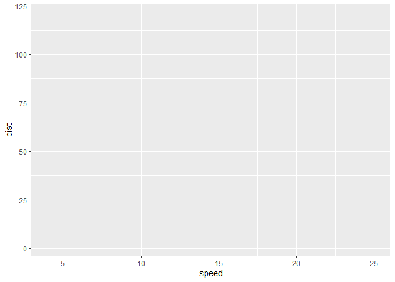
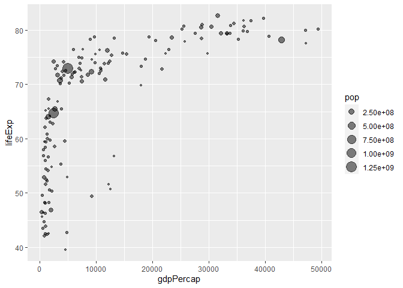
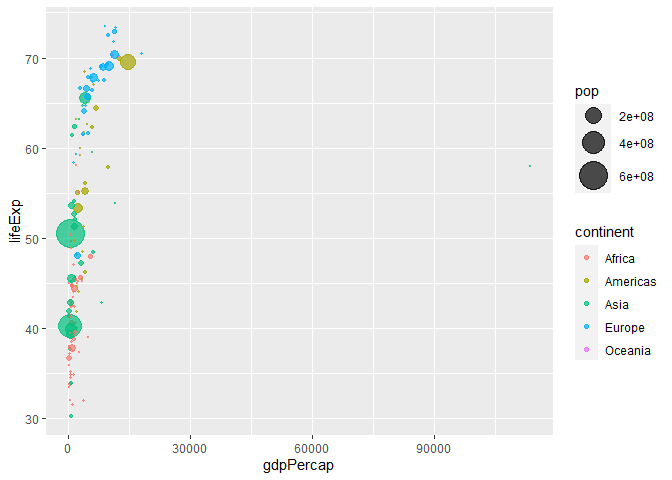
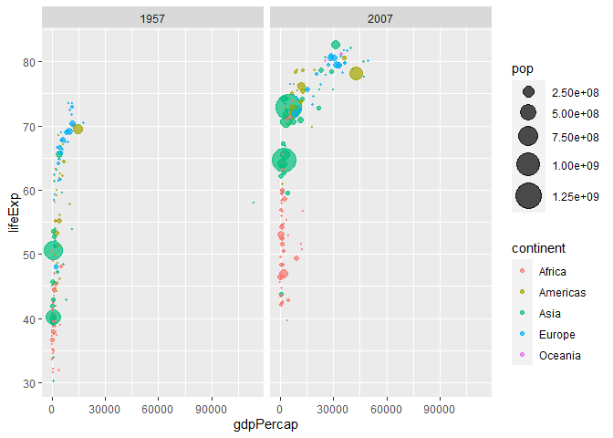

Class 5: Data Visualizations with GGPLOT
================
Olivia Chu

# Plotting in R

R has multiple plotting and graphics systems. The most popular of which
is **ggplot2**.

We have already played with “base” R graphics. This comes along with R
“out of the box”.

``` r
plot(cars)
```


Compared to base R plots, ggplot is much more verbose - I need to write
more code to get simple plots like the above.

To use ggplot, I need to first install the ggplot2 package. To install
any package in R, I use the `install.packages()` command along with the
package name.

The install is a one-time only requirement. The package is now on our
computer. I don’t need to re-install it.

However, I can’t just use it without loading it up with a `library()`
call.

``` r
#install.packages("ggplot2")
library(ggplot2)
```

``` r
ggplot(cars)
```


``` r
ggplot(cars) +
  aes(x=speed, y=dist)
```



All ggplot figures need at least 3 things:

- data (this is the data.frame with our numbers)
- aesthetics (“aes”, how our data maps to the plot)
- geoms (do you want lines, points, columns, etc…)

``` r
ggplot(data=cars) +
  aes(x=speed, y=dist) +
  geom_point()
```


I want a trendline to show the relationship between speed and stopping
distance…

``` r
ggplot(data=cars) +
  aes(x=speed, y=dist) +
  geom_point() +
  geom_line()
```


This is not what we want.

``` r
bb <- ggplot(data=cars) +
  aes(x=speed, y=dist) +
  geom_point()

bb
```


``` r
bb + geom_smooth(method = "lm", se=FALSE)
```

    `geom_smooth()` using formula = 'y ~ x'


``` r
ggplot(cars) + 
  aes(x=speed, y=dist) +
  geom_point() +
  labs(title="Speed and Stopping Distances of Cars",
       x="Speed (MPH)", 
       y="Stopping Distance (ft)",
       subtitle = "Comparison of different cars",
       caption="Dataset: 'cars'") +
  geom_smooth(method="lm", se=FALSE) +
  theme_bw()
```

    `geom_smooth()` using formula = 'y ~ x'


# Gene Expression Example

``` r
url <- "https://bioboot.github.io/bimm143_S20/class-material/up_down_expression.txt"
genes <- read.delim(url)
head(genes)
```

            Gene Condition1 Condition2      State
    1      A4GNT -3.6808610 -3.4401355 unchanging
    2       AAAS  4.5479580  4.3864126 unchanging
    3      AASDH  3.7190695  3.4787276 unchanging
    4       AATF  5.0784720  5.0151916 unchanging
    5       AATK  0.4711421  0.5598642 unchanging
    6 AB015752.4 -3.6808610 -3.5921390 unchanging

The `head()` function will print out just the first few rows (by 6).

``` r
ggplot(genes) +
  aes(x=Condition1, y=Condition2) +
  geom_point()
```


``` r
p <- ggplot(genes) +
  aes(x=Condition1, y=Condition2, col=State) +
  geom_point()

p
```


``` r
p + scale_colour_manual( values=c("blue", "gray", "red"))
```


``` r
p + scale_colour_manual(values=c("blue", "gray", "red")) +
  labs(title="Gene Expression Changes Upon Drug Treatment", 
       x="Control (no drug)",
       y="Drug Treatment")
```


\`\`\`

# Section 7 Gapminder Example

``` r
#install.packages("gapminder")
library(gapminder)

#Second method
#url2 <- "https://raw.githubusercontent.com/jennybc/gapminder/master/inst/extdata/gapminder.tsv"

#gapminder <- read.delim(url2)

#install.packages("dplyr")
library(dplyr)
```


    Attaching package: 'dplyr'

    The following objects are masked from 'package:stats':

        filter, lag

    The following objects are masked from 'package:base':

        intersect, setdiff, setequal, union

``` r
gapminder_2007 <- gapminder %>% filter(year==2007)
```

``` r
library(ggplot2)
```

``` r
ggplot(gapminder_2007) +
  aes(x=gdpPercap, y=lifeExp) +
  geom_point()
```


``` r
ggplot(gapminder_2007) +
  aes(x=gdpPercap, y=lifeExp) +
  geom_point(alpha=0.5)
```


``` r
ggplot(gapminder_2007) +
  aes(x=gdpPercap, y=lifeExp, color=continent, size=pop) +
  geom_point(alpha=0.5)
```


``` r
ggplot(gapminder_2007) +
  aes(x=gdpPercap, y=lifeExp, color=pop) +
  geom_point(alpha=0.8)
```


``` r
ggplot(gapminder_2007) +
  aes(x=gdpPercap, y=lifeExp, size=pop) +
  geom_point(alpha=0.5)
```



``` r
ggplot(gapminder_2007) +
  geom_point(aes(x=gdpPercap, y=lifeExp,
                 size=pop), alpha=0.5) +
  scale_size_area(max_size=10)
```


Producing for the year 1957:

``` r
gapminder_1957 <- gapminder %>% filter(year==1957)

ggplot(gapminder_1957) + 
  aes(x = gdpPercap, y = lifeExp, color=continent,
                 size = pop) +
  geom_point(alpha=0.7) + 
  scale_size_area(max_size = 10)
```



``` r
gapminder_1957 <- gapminder %>% filter(year==1957 | year==2007)

ggplot(gapminder_1957) + 
  geom_point(aes(x = gdpPercap, y = lifeExp, color=continent,
                 size = pop), alpha=0.7) + 
  scale_size_area(max_size = 10) +
  facet_wrap(~year)
```


