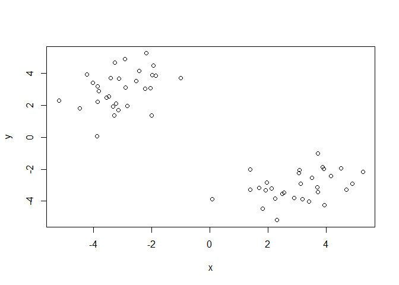
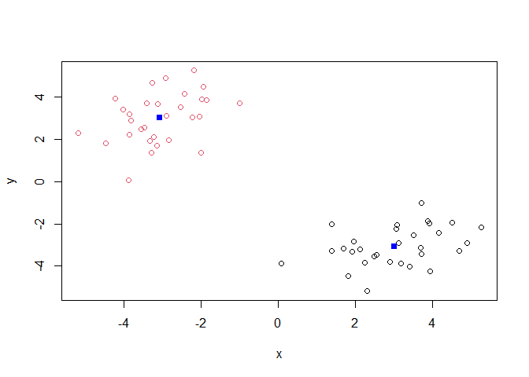
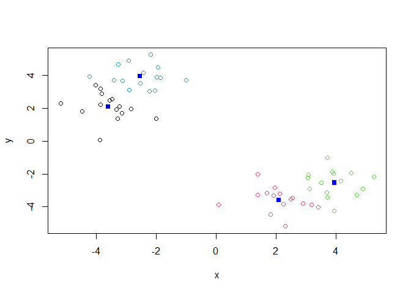
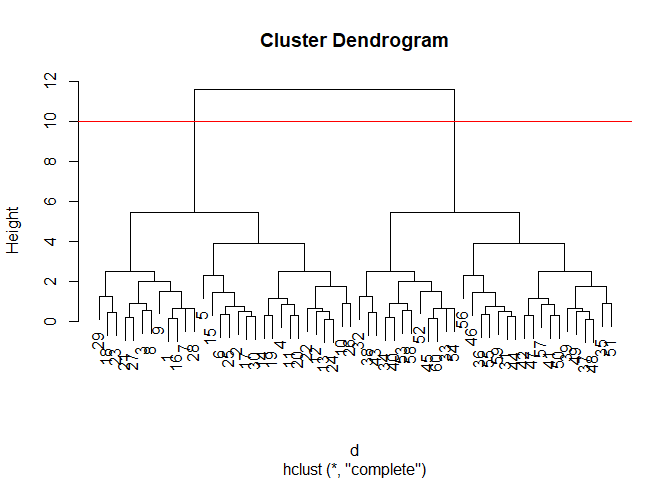
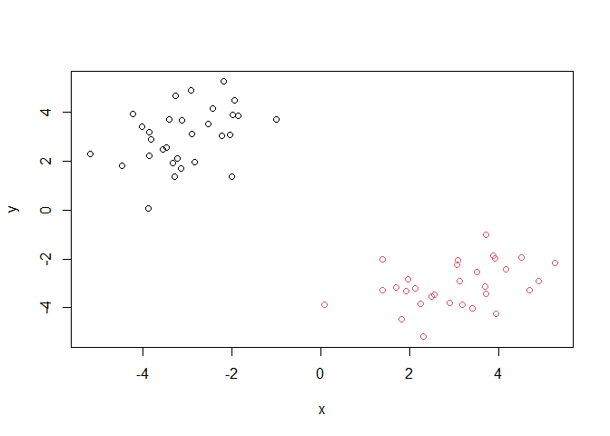

Class 7: Machine Learning I
================
Olivia Chu

In this class, we will explore clustering and dimensionality reduction
methods.

## K-means

Make up some input data where we know what the answer should be.

``` r
tmp <- c( rnorm(30, -3), rnorm(30, +3) )
x <- cbind(x=tmp, y=rev(tmp))
head(x)
```

                 x          y
    [1,] -1.862957 3.88542268
    [2,] -2.841258 1.95935429
    [3,] -2.894348 3.11924547
    [4,] -4.230564 3.94900223
    [5,] -3.874718 0.08582588
    [6,] -3.147832 1.69215585

Quick plot of x to see the two groups at -3,+3 and +3,-3.

``` r
plot(x)
```



Use the `kmeans()` function, setting k to 2 and nstart=20.

``` r
km <- kmeans(x, centers = 2, nstart=20)
km
```

    K-means clustering with 2 clusters of sizes 30, 30

    Cluster means:
              x         y
    1  3.024117 -3.062109
    2 -3.062109  3.024117

    Clustering vector:
     [1] 2 2 2 2 2 2 2 2 2 2 2 2 2 2 2 2 2 2 2 2 2 2 2 2 2 2 2 2 2 2 1 1 1 1 1 1 1 1
    [39] 1 1 1 1 1 1 1 1 1 1 1 1 1 1 1 1 1 1 1 1 1 1

    Within cluster sum of squares by cluster:
    [1] 65.71656 65.71656
     (between_SS / total_SS =  89.4 %)

    Available components:

    [1] "cluster"      "centers"      "totss"        "withinss"     "tot.withinss"
    [6] "betweenss"    "size"         "iter"         "ifault"      

> Q. How many points are in each cluster?

``` r
km$size
```

    [1] 30 30

Each cluster has 30 points.

> Q. What ‘component’ of your result object details… - cluster
> assignment/membership? - cluster center?

``` r
km$cluster
```

     [1] 2 2 2 2 2 2 2 2 2 2 2 2 2 2 2 2 2 2 2 2 2 2 2 2 2 2 2 2 2 2 1 1 1 1 1 1 1 1
    [39] 1 1 1 1 1 1 1 1 1 1 1 1 1 1 1 1 1 1 1 1 1 1

``` r
km$centers
```

              x         y
    1  3.024117 -3.062109
    2 -3.062109  3.024117

> Q. Plot x colored by the kmeans cluster assignment and add cluster
> centers as blue points.

``` r
plot(x, col=km$cluster)
points(km$centers, col="blue", pch=15)
```



Play with kmeans and ask for different numbers of clusters.

``` r
km <- kmeans(x, centers = 4, nstart=20)
plot(x, col=km$cluster)
points(km$centers, col="blue", pch=15)
```



# Hierarchial Clustering

This is another very useful and widely employed clustering method which
has the advantage over kmeans in that it can help reveal the something
of the true grouping in your data.

The `hclust()` function wants a distance matrix as input. We can get
this from the `dist()` function.

``` r
d <- dist(x)
hc <- hclust(d)
hc
```


    Call:
    hclust(d = d)

    Cluster method   : complete 
    Distance         : euclidean 
    Number of objects: 60 

There is a plot method for hclust results:

``` r
plot(hc)
abline(h=10, col="red")
```



To get my cluster membership vector, I need to “cut” my tree to yield
sub-trees or branches with all the members of a given cluster residing
on the same cut branch. The function to do this is called `cutree()`.

``` r
grps <- cutree(hc, h=10)
grps
```

     [1] 1 1 1 1 1 1 1 1 1 1 1 1 1 1 1 1 1 1 1 1 1 1 1 1 1 1 1 1 1 1 2 2 2 2 2 2 2 2
    [39] 2 2 2 2 2 2 2 2 2 2 2 2 2 2 2 2 2 2 2 2 2 2

``` r
plot(x, col=grps)
```



It is often helpful to use the `k=` argument to cutree rather than the
`h=` height of cutting with `cutree()`. This will cut the tree to yield
the number of clusters you want.

``` r
cutree(hc, k=4)
```

     [1] 1 2 1 2 2 2 1 1 1 2 2 2 2 2 2 1 2 1 2 2 1 2 1 2 2 2 1 1 1 2 3 4 4 4 3 3 3 4
    [39] 3 4 3 3 4 3 4 3 3 3 3 3 3 4 4 4 3 3 3 4 3 4

# Principal Component Analysis (PCA)

The base R function for PCA is called `prcomp()`.

## PCA of UK food data

Import the data.

``` r
url <- "https://tinyurl.com/UK-foods"
x <- read.csv(url)
head(x)
```

                   X England Wales Scotland N.Ireland
    1         Cheese     105   103      103        66
    2  Carcass_meat      245   227      242       267
    3    Other_meat      685   803      750       586
    4           Fish     147   160      122        93
    5 Fats_and_oils      193   235      184       209
    6         Sugars     156   175      147       139

> Q1. How many rows and columns are in your new data frame named x? What
> R functions could you use to answer this questions?

``` r
# Complete the following code to find out how many rows and columns are in x?
dim(x)
```

    [1] 17  5

Using the `dim()` function, I found that there are 17 rows and 5 columns
in my data frame x. I can also use the functions `nrow()` and `ncol()`
to find the number of rows and columns.

``` r
# This is the minus indexing approach that does not work
# rownames(x) <- x[,1]
# x <- x[,-1]
# head(x)

# Here, I am removing the first column in order to make sure my first column is "England" and not the food groups.
x <- read.csv(url, row.names=1)
head(x)
```

                   England Wales Scotland N.Ireland
    Cheese             105   103      103        66
    Carcass_meat       245   227      242       267
    Other_meat         685   803      750       586
    Fish               147   160      122        93
    Fats_and_oils      193   235      184       209
    Sugars             156   175      147       139

``` r
dim(x)
```

    [1] 17  4

Using the `dim()` function, there are now 17 rows and 4 columns in data
frame ‘x’.

> Q2. Which approach to solving the ‘row-names problem’ mentioned above
> do you prefer and why? Is one approach more robust than another under
> certain circumstances?

I prefer to use the approach that sets the correct row names as opposed
to removing the first column. This is because if we were to write the
code to delete the first row, every time to run the code, a column will
be deleted until we run into an ‘Error’ message.

With the second approach, this does not happen. Once the rows are set
correctly, they remain that way.

``` r
barplot(as.matrix(x), beside=T, col=rainbow(nrow(x)))
```


> Q3. Changing what optional argument in the above barplot() function
> results in the following plot?

Changing the ‘beside’ argument to ‘beside=F’ will result in the
following plot (containing 4 bars). This tells the function to stack the
sub-bars.

``` r
barplot(as.matrix(x), beside=F, col=rainbow(nrow(x)))
```


> Q5. Generating all pairwise plots may help somewhat. Can you make
> sense of the following code and resulting figure? What does it mean if
> a given point lies on the diagonal for a given plot?

``` r
pairs(x, col=rainbow(10), pch=16)
```


These plots show the comparison of food type consumption between two
respective countries.

If a given point lies on the diagonal for a given plot, that means there
is a positive correlation between the two countries and that they
consume similar amounts of that specific food type.

> Q6. What are the main differences between N. Ireland and the other
> countries of the UK in terms of this data-set?

N. Ireland consumes vastly different amounts of fresh potatoes, fresh
fruit, and alcoholic drinks compared to the other countries of this
data-set.

``` r
# Use the prcomp() PCA function
pca <- prcomp( t(x) )
summary(pca)
```

    Importance of components:
                                PC1      PC2      PC3       PC4
    Standard deviation     324.1502 212.7478 73.87622 4.189e-14
    Proportion of Variance   0.6744   0.2905  0.03503 0.000e+00
    Cumulative Proportion    0.6744   0.9650  1.00000 1.000e+00

A “PCA plot” (a.k.a “Score plot”, PC1vsPC2 plot, etc.)

> Q7. Complete the code below to generate a plot of PC1 vs PC2. The
> second line adds text labels over the data points.

``` r
# Plot PC1 vs PC2
plot( pca$x[,1], pca$x[,2], xlab="PC1", ylab="PC2", xlim=c(-270,500) )
text(pca$x[,1], pca$x[,2], colnames(x))
```


> Q8. Customize your plot so that the colors of the country names match
> the colors in our UK and Ireland map and table at start of this
> document.

``` r
plot( pca$x[,1], pca$x[,2], xlab="PC1", ylab="PC2", xlim=c(-270,500) )
text(pca$x[,1], pca$x[,2], colnames(x), col=c("orange", "red", "blue", "darkgreen"))
```


``` r
# Calculate how much variation in the original data each PC accounts for
v <- round( pca$sdev^2/sum(pca$sdev^2) * 100 )
v
```

    [1] 67 29  4  0

``` r
# or the second row here...
z <- summary(pca)
z$importance
```

                                 PC1       PC2      PC3          PC4
    Standard deviation     324.15019 212.74780 73.87622 4.188568e-14
    Proportion of Variance   0.67444   0.29052  0.03503 0.000000e+00
    Cumulative Proportion    0.67444   0.96497  1.00000 1.000000e+00

``` r
#Plot of variances
barplot(v, xlab="Principal Component", ylab="Percent Variation")
```


Let’s focus on PC1 as it accounts for \> 90% of variance.

``` r
par(mar=c(10, 3, 0.35, 0))
barplot( pca$rotation[,1], las=2 )
```


> Q9: Generate a similar ‘loadings plot’ for PC2. What two food groups
> feature prominantely and what does PC2 maninly tell us about?

``` r
par(mar=c(10, 3, 0.35, 0))
barplot( pca$rotation[,2], las=2 )
```


The two food groups that feature predominantly are fresh potatoes and
soft drinks.
