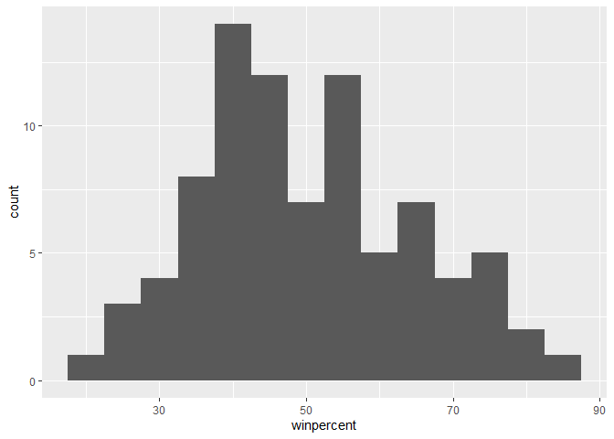
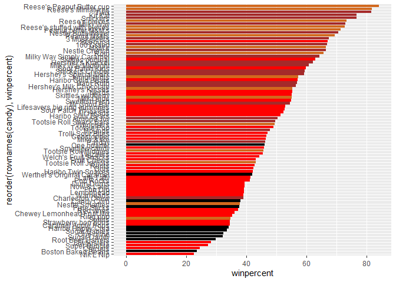
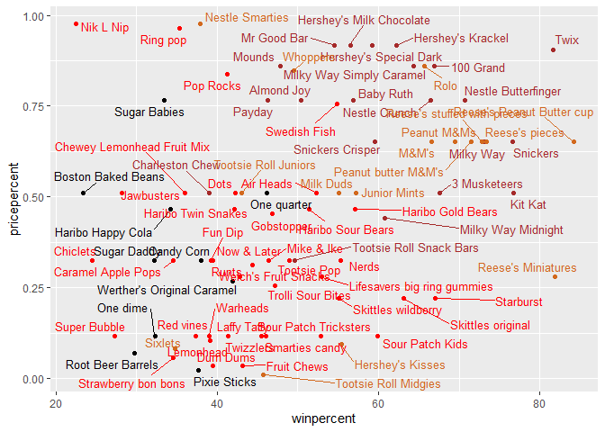
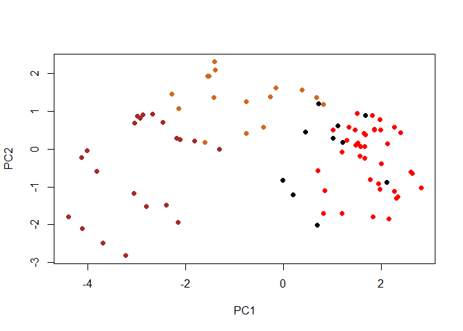
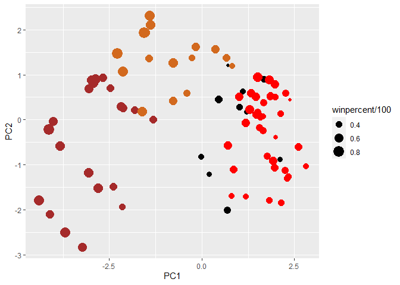
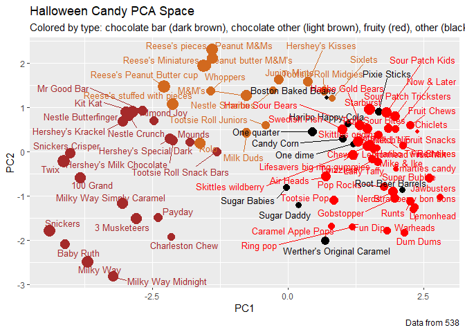
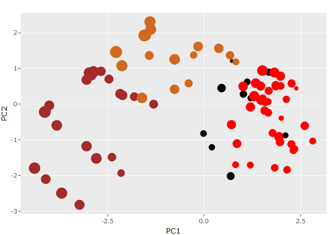

Class 10: Halloween Mini-Project
================
Olivia Chu

In this mini project, we will be exploring FiveThirtyEight’s Halloween
Candy dataset, which contains the results of their poll asking Americans
what is their favorite candy.

## Importing Candy Data

Data will be imported from the FiveThirtyEight GitHub repo.

``` r
url <- "https://raw.githubusercontent.com/fivethirtyeight/data/master/candy-power-ranking/candy-data.csv"

candy <- read.csv(url, row.names=1)

head(candy)
```

                 chocolate fruity caramel peanutyalmondy nougat crispedricewafer
    100 Grand            1      0       1              0      0                1
    3 Musketeers         1      0       0              0      1                0
    One dime             0      0       0              0      0                0
    One quarter          0      0       0              0      0                0
    Air Heads            0      1       0              0      0                0
    Almond Joy           1      0       0              1      0                0
                 hard bar pluribus sugarpercent pricepercent winpercent
    100 Grand       0   1        0        0.732        0.860   66.97173
    3 Musketeers    0   1        0        0.604        0.511   67.60294
    One dime        0   0        0        0.011        0.116   32.26109
    One quarter     0   0        0        0.011        0.511   46.11650
    Air Heads       0   0        0        0.906        0.511   52.34146
    Almond Joy      0   1        0        0.465        0.767   50.34755

> Q1. How many different candy types are in this dataset?

``` r
nrow(candy)
```

    [1] 85

There are 85 candy types in this dataset.

> Q2. How many fruity candy types are in the dataset?

``` r
sum(candy$fruity)
```

    [1] 38

There are 38 fruity candy types in this dataset.

# What is your favorite candy?

One of the most interesting variables in the dataset is winpercent. For
a given candy, this value is the percentage of people who prefer this
candy over another randomly chosen candy from the dataset (what 538
terms a “match-up”). Higher values indicate a more popular candy.

> Q3. What is your favorite candy in the dataset and what is it’s
> winpercent value?

My favorite candy in the dataset is Milky Way.

``` r
candy["Milky Way", ]$winpercent
```

    [1] 73.09956

Milky Way’s winpercent value is 73.09956%.

> Q4. What is the winpercent value for “Kit Kat”?

``` r
candy["Kit Kat", ]$winpercent
```

    [1] 76.7686

Kit Kat’s winpercent value is 81.64291%.

> Q5. What is the winpercent value for “Tootsie Roll Snack Bars”?

``` r
candy["Tootsie Roll Snack Bars", ]$winpercent
```

    [1] 49.6535

Tootsie Roll Snack Bars’s winpercent is 49.6535%.

# Side-note: the skimr::skim() function

There is a useful `skim()` function in the skimr package that can help
give you a quick overview of a given dataset. Let’s install this package
and try it on our candy data.

``` r
# install.packages("devtools")
# devtools::install_github("ropensci/skimr")

library("skimr")
skim(candy)
```

|                                                  |       |
|:-------------------------------------------------|:------|
| Name                                             | candy |
| Number of rows                                   | 85    |
| Number of columns                                | 12    |
| \_\_\_\_\_\_\_\_\_\_\_\_\_\_\_\_\_\_\_\_\_\_\_   |       |
| Column type frequency:                           |       |
| numeric                                          | 12    |
| \_\_\_\_\_\_\_\_\_\_\_\_\_\_\_\_\_\_\_\_\_\_\_\_ |       |
| Group variables                                  | None  |

Data summary

**Variable type: numeric**

| skim_variable    | n_missing | complete_rate |  mean |    sd |    p0 |   p25 |   p50 |   p75 |  p100 | hist  |
|:-----------------|----------:|--------------:|------:|------:|------:|------:|------:|------:|------:|:------|
| chocolate        |         0 |             1 |  0.44 |  0.50 |  0.00 |  0.00 |  0.00 |  1.00 |  1.00 | ▇▁▁▁▆ |
| fruity           |         0 |             1 |  0.45 |  0.50 |  0.00 |  0.00 |  0.00 |  1.00 |  1.00 | ▇▁▁▁▆ |
| caramel          |         0 |             1 |  0.16 |  0.37 |  0.00 |  0.00 |  0.00 |  0.00 |  1.00 | ▇▁▁▁▂ |
| peanutyalmondy   |         0 |             1 |  0.16 |  0.37 |  0.00 |  0.00 |  0.00 |  0.00 |  1.00 | ▇▁▁▁▂ |
| nougat           |         0 |             1 |  0.08 |  0.28 |  0.00 |  0.00 |  0.00 |  0.00 |  1.00 | ▇▁▁▁▁ |
| crispedricewafer |         0 |             1 |  0.08 |  0.28 |  0.00 |  0.00 |  0.00 |  0.00 |  1.00 | ▇▁▁▁▁ |
| hard             |         0 |             1 |  0.18 |  0.38 |  0.00 |  0.00 |  0.00 |  0.00 |  1.00 | ▇▁▁▁▂ |
| bar              |         0 |             1 |  0.25 |  0.43 |  0.00 |  0.00 |  0.00 |  0.00 |  1.00 | ▇▁▁▁▂ |
| pluribus         |         0 |             1 |  0.52 |  0.50 |  0.00 |  0.00 |  1.00 |  1.00 |  1.00 | ▇▁▁▁▇ |
| sugarpercent     |         0 |             1 |  0.48 |  0.28 |  0.01 |  0.22 |  0.47 |  0.73 |  0.99 | ▇▇▇▇▆ |
| pricepercent     |         0 |             1 |  0.47 |  0.29 |  0.01 |  0.26 |  0.47 |  0.65 |  0.98 | ▇▇▇▇▆ |
| winpercent       |         0 |             1 | 50.32 | 14.71 | 22.45 | 39.14 | 47.83 | 59.86 | 84.18 | ▃▇▆▅▂ |

> Q6. Is there any variable/column that looks to be on a different scale
> to the majority of the other columns in the dataset?

Mean and standard deviation look to be on a different scale to the
majority of the other columns in the data.

> Q7. What do you think a zero and one represent for the
> candy\$chocolate column?

In the candy\$chocolate column, a 1 represents “yes, there is chocolate
in this candy” and 0 represents “no, there is no chocolate in this
candy.”

A good place to start any exploratory analysis is with a histogram. We
can use either `hist()` or `ggplot()` with `geom_hist()`.

# Plots

> Q8. Plot a histogram of winpercent values

``` r
# hist(candy$winpercent)

library(ggplot2)

ggplot(candy, aes(winpercent)) +
  geom_histogram(binwidth=5)
```



> Q9. Is the distribution of winpercent values symmetrical?

No, the distribution of winpercent values is not symmetrical.

> Q10. Is the center of the distribution above or below 50%?

The center of distribution is below 50%.

> Q11. On average is chocolate candy higher or lower ranked than fruit
> candy?

``` r
mean(candy$winpercent[as.logical(candy$chocolate)])
```

    [1] 60.92153

``` r
mean(candy$winpercent[as.logical(candy$fruity)])
```

    [1] 44.11974

On average, chocolate candy is higher ranked than fruity candy (61% vs
44%).

> Q12. Is this difference statistically significant?

``` r
t.test(candy$winpercent[as.logical(candy$chocolate)], candy$winpercent[as.logical(candy$fruity)])
```


        Welch Two Sample t-test

    data:  candy$winpercent[as.logical(candy$chocolate)] and candy$winpercent[as.logical(candy$fruity)]
    t = 6.2582, df = 68.882, p-value = 2.871e-08
    alternative hypothesis: true difference in means is not equal to 0
    95 percent confidence interval:
     11.44563 22.15795
    sample estimates:
    mean of x mean of y 
     60.92153  44.11974 

The p-value is 2.871e-08, which is smaller than 0.05. This indicates
that the difference is statistically significant.

# Overall Candy Rankings

Let’s use the base R `order()` function together with `head()` to sort
the whole dataset by winpercent, or you can use the function `arrange()`
with `head()` if using the dplyr package.

``` r
# head(candy[order(candy$winpercent),], n=5)

# install.packages("dplyr")
library(dplyr)
```


    Attaching package: 'dplyr'

    The following objects are masked from 'package:stats':

        filter, lag

    The following objects are masked from 'package:base':

        intersect, setdiff, setequal, union

``` r
candy %>% arrange(winpercent) %>% head(5)
```

                       chocolate fruity caramel peanutyalmondy nougat
    Nik L Nip                  0      1       0              0      0
    Boston Baked Beans         0      0       0              1      0
    Chiclets                   0      1       0              0      0
    Super Bubble               0      1       0              0      0
    Jawbusters                 0      1       0              0      0
                       crispedricewafer hard bar pluribus sugarpercent pricepercent
    Nik L Nip                         0    0   0        1        0.197        0.976
    Boston Baked Beans                0    0   0        1        0.313        0.511
    Chiclets                          0    0   0        1        0.046        0.325
    Super Bubble                      0    0   0        0        0.162        0.116
    Jawbusters                        0    1   0        1        0.093        0.511
                       winpercent
    Nik L Nip            22.44534
    Boston Baked Beans   23.41782
    Chiclets             24.52499
    Super Bubble         27.30386
    Jawbusters           28.12744

``` r
candy %>% arrange(winpercent) %>% tail(5)
```

                              chocolate fruity caramel peanutyalmondy nougat
    Snickers                          1      0       1              1      1
    Kit Kat                           1      0       0              0      0
    Twix                              1      0       1              0      0
    Reese's Miniatures                1      0       0              1      0
    Reese's Peanut Butter cup         1      0       0              1      0
                              crispedricewafer hard bar pluribus sugarpercent
    Snickers                                 0    0   1        0        0.546
    Kit Kat                                  1    0   1        0        0.313
    Twix                                     1    0   1        0        0.546
    Reese's Miniatures                       0    0   0        0        0.034
    Reese's Peanut Butter cup                0    0   0        0        0.720
                              pricepercent winpercent
    Snickers                         0.651   76.67378
    Kit Kat                          0.511   76.76860
    Twix                             0.906   81.64291
    Reese's Miniatures               0.279   81.86626
    Reese's Peanut Butter cup        0.651   84.18029

> Q13. What are the five least liked candy types in this set?

The five least liked candy types in this set are: Nik L Nip, Boston
Baked Beans, Chiclets, Super Bubble, and Jawbusters.

> Q14. What are the top 5 all time favorite candy types out of this set?

The top 5 all time favorite candy types out of this set are Snickers,
Kit Kat, Twix, Reese’s Miniatures, and Reese’s Peanut Butter cup.

To examine more of the dataset in this vain, we can make a barplot to
visualize the overall rankings. We will use an iterative approach to
building a useful visualization by getting a rough starting plot and
then refining and adding useful details in a stepwise process.

> Q15. Make a first barplot of candy ranking based on winpercent values.

``` r
library(ggplot2)

ggplot(candy, aes(winpercent, rownames(candy))) +
  geom_col()
```


> Q16. This is quite ugly, use the reorder() function to get the bars
> sorted by winpercent.

``` r
ggplot(candy, aes(winpercent, reorder(rownames(candy),winpercent))) +
  geom_col()
```


# Time to add some useful color

Let’s setup a color vector (that signifies candy type) that we can then
use for some future plots. We start by making a vector of all black
values (one for each candy). Then we overwrite chocolate (for chocolate
candy), brown (for candy bars) and red (for fruity candy) values.

``` r
my_cols=rep("black", nrow(candy))
my_cols[as.logical(candy$chocolate)] = "chocolate"
my_cols[as.logical(candy$bar)] = "brown"
my_cols[as.logical(candy$fruity)] = "red"
```

Now, let’s make a new bar plot using these new colors.

``` r
ggplot(candy) + 
  aes(winpercent, reorder(rownames(candy),winpercent)) +
  geom_col(fill=my_cols) 
```



> Q17. What is the worst ranked chocolate candy?

The worse ranked chocolate candy is Sixlets.

> Q18. What is the best ranked fruity candy?

The best ranked fruity candy is Starburst.

# Taking a look at pricepercent

What is the the best candy for the least money? One way to get at this
would be to make a plot of winpercent vs the pricepercent variable. The
pricepercent variable records the percentile rank of the candy’s price
against all the other candies in the dataset. Lower vales are less
expensive and high values more expensive.

To this plot, we will add text labels so we can more easily identify a
given candy. There is a regular `geom_label()` that comes with ggplot2.
However, as there are quite a few candies in our dataset, lots of these
labels will be overlapping and hard to read. To help with this, we can
use the `geom_text_repel()` function from the ggrepel package.

``` r
# install.packages("ggrepel")

library(ggrepel)

# How about a plot of price vs win
ggplot(candy) +
  aes(winpercent, pricepercent, label=rownames(candy)) +
  geom_point(col=my_cols) + 
  geom_text_repel(col=my_cols, size=3.3, max.overlaps = 25)
```



> Q19. Which candy type is the highest ranked in terms of winpercent for
> the least money - i.e. offers the most bang for your buck?

Reese’s Miniatures are the highest ranked in terms of winpercent for the
least money. When looking at overall types, more fruity candy types have
the highest rank in terms of winpercent for the least money.

> Q20. What are the top 5 most expensive candy types in the dataset and
> of these which is the least popular?

``` r
ord <- order(candy$pricepercent, decreasing = TRUE)
head( candy[ord,c(11,12)], n=5 )
```

                             pricepercent winpercent
    Nik L Nip                       0.976   22.44534
    Nestle Smarties                 0.976   37.88719
    Ring pop                        0.965   35.29076
    Hershey's Krackel               0.918   62.28448
    Hershey's Milk Chocolate        0.918   56.49050

The top 5 most expensive candy types in the dataset are: Nik L Nip,
Nestle Smarties, Ring pop, Hershey’s Krackel, and Hershey’s Milk
Chocolate.

Of these 5, the candy type that is the least popular is Nik L Nip.

# Exploring the correlation structure

Now that we’ve explored the dataset a little, we’ll see how the
variables interact with one another. We’ll use correlation and view the
results with the corrplot package to plot a correlation matrix.

``` r
# install.packages("corrplot")
library(corrplot)
```

    corrplot 0.92 loaded

``` r
cij <- cor(candy)
corrplot(cij)
```


> Q22. Examining this plot what two variables are anti-correlated
> (i.e. have minus values)?

The two variables that are anti-correlated are chocolate and fruity (and
pluribus and bar).

> Q23. Similarly, what two variables are most positively correlated?

Two variables that are most positively correlated are chocolate and bar
(and chocolate and winpercent).

# Principal Component Analysis

Let’s apply PCA using the `prcom()` function to our candy dataset,
remembering to set the scale=TRUE argument.

``` r
pca <- prcomp(candy, scale=TRUE)

summary(pca)
```

    Importance of components:
                              PC1    PC2    PC3     PC4    PC5     PC6     PC7
    Standard deviation     2.0788 1.1378 1.1092 1.07533 0.9518 0.81923 0.81530
    Proportion of Variance 0.3601 0.1079 0.1025 0.09636 0.0755 0.05593 0.05539
    Cumulative Proportion  0.3601 0.4680 0.5705 0.66688 0.7424 0.79830 0.85369
                               PC8     PC9    PC10    PC11    PC12
    Standard deviation     0.74530 0.67824 0.62349 0.43974 0.39760
    Proportion of Variance 0.04629 0.03833 0.03239 0.01611 0.01317
    Cumulative Proportion  0.89998 0.93832 0.97071 0.98683 1.00000

Let’s plot our main PCA score plot of PC1 vs PC2.

``` r
plot(pca$x[,1:2])
```


Let’s add color.

``` r
plot(pca$x[,1:2], col=my_cols, pch=16)
```



If we want to make a nicer plot, we can use the ggplot2 package. Before
doing so, we must create a new data.frame that includes a separate
column for each aesthetic along with out PCA results and candy data.

``` r
# Make a new data-frame with our PCA results and candy data
my_data <- cbind(candy, pca$x[,1:3])

p <- ggplot(my_data) + 
        aes(x=PC1, y=PC2, 
            size=winpercent/100,  
            text=rownames(my_data),
            label=rownames(my_data)) +
        geom_point(col=my_cols)

p
```



Again, we can use the ggrepel package and the function
`ggrepel::geom_text_repel()` to label up the plot with non-overlapping
candy names. We will also add a title and subtitle like so:

``` r
library(ggrepel)

p + geom_text_repel(size=3.3, col=my_cols, max.overlaps = 37)  + 
  theme(legend.position = "none") +
  labs(title="Halloween Candy PCA Space",
       subtitle="Colored by type: chocolate bar (dark brown), chocolate other (light brown), fruity (red), other (black)",
       caption="Data from 538")
```



If you want to see more candy labels, you can change the max.overlaps
value to allow more overlapping labels or pass the ggplot object p to
plotly, like so, to generate an interactive plot that you can move your
mouse over to see labels:

``` r
# install.packages("plotly")
library(plotly)
```


    Attaching package: 'plotly'

    The following object is masked from 'package:ggplot2':

        last_plot

    The following object is masked from 'package:stats':

        filter

    The following object is masked from 'package:graphics':

        layout

``` r
ggplotly(p)
```



Let’s finish by taking a quick look at our PCA loadings. Do these make
sense to you? Notice the opposite effects of chocolate and fruity and
the similar effects of chocolate and bar (i.e. we already know they are
correlated).

``` r
par(mar=c(8,4,2,2))
barplot(pca$rotation[,1], las=2, ylab="PC1 Contribution")
```


> Q24. What original variables are picked up strongly by PC1 in the
> positive direction? Do these make sense to you?

The original variables that are picked up strongly by PC1 in the
positive direction are fruity, hard, and pluribus. This does make sense
since these 3 variables had more negative correlation (or less positive
correlation) with the other variables in the dataset.
