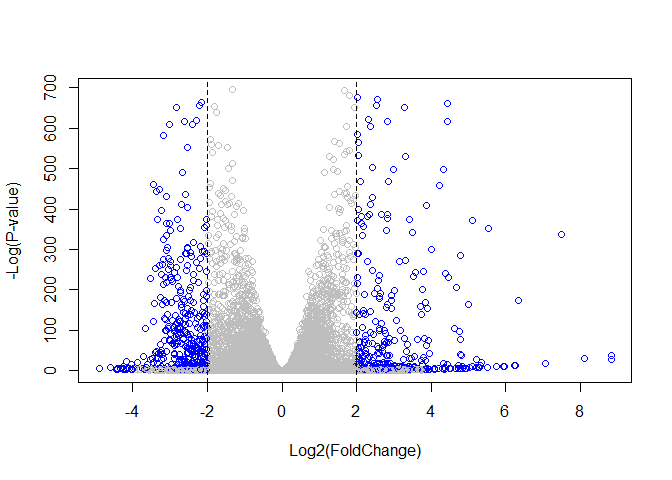
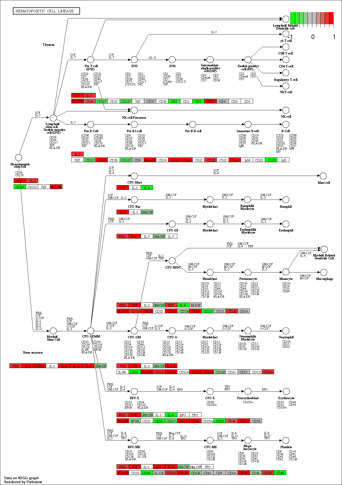
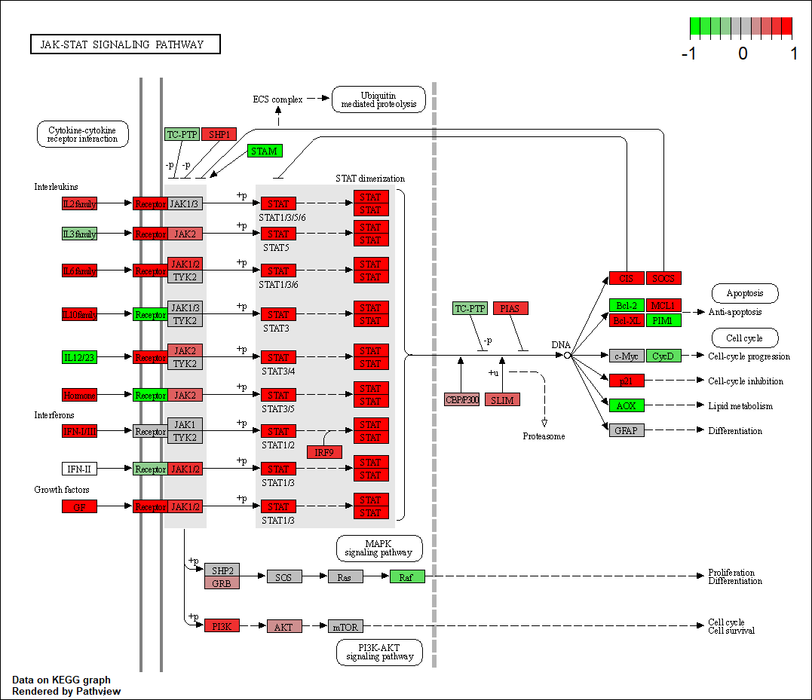
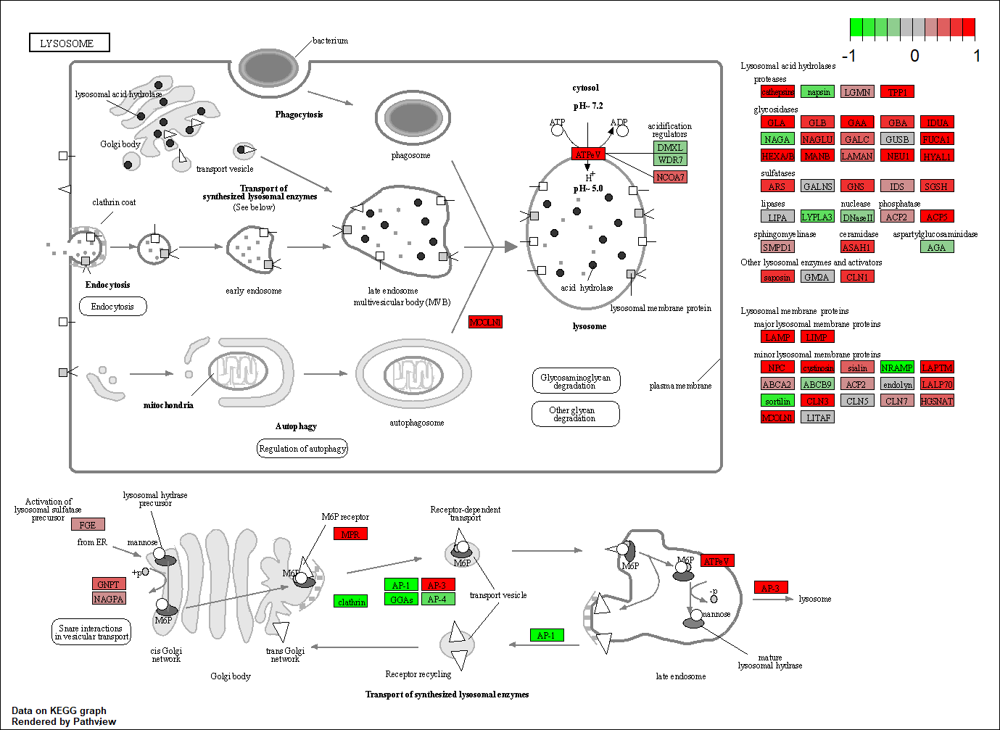
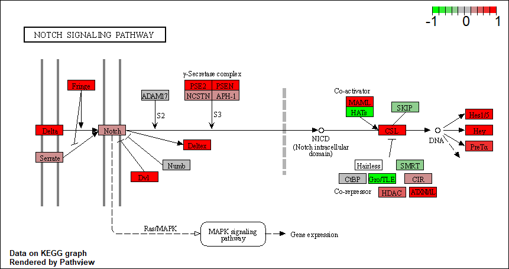
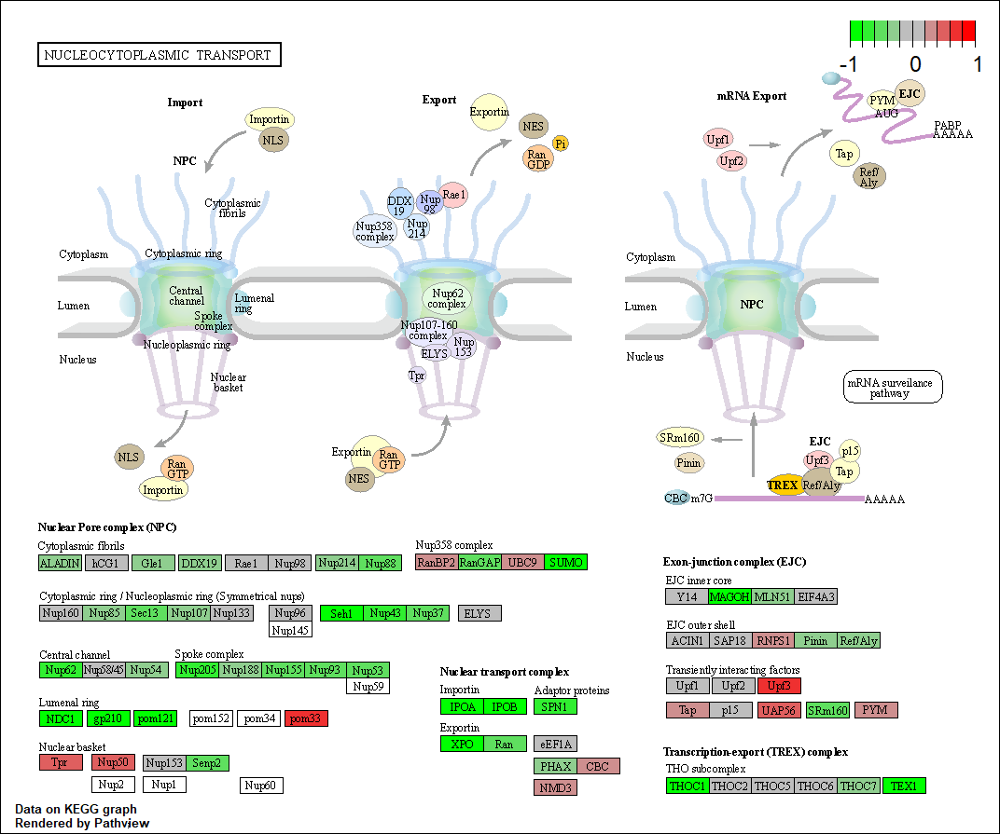
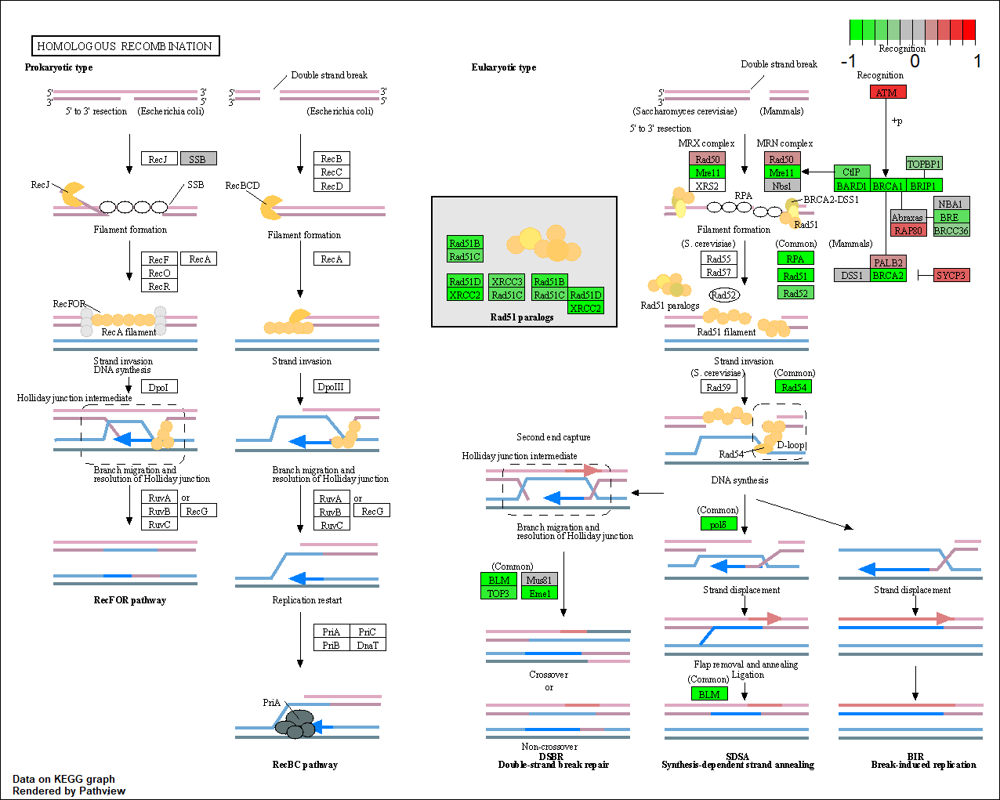
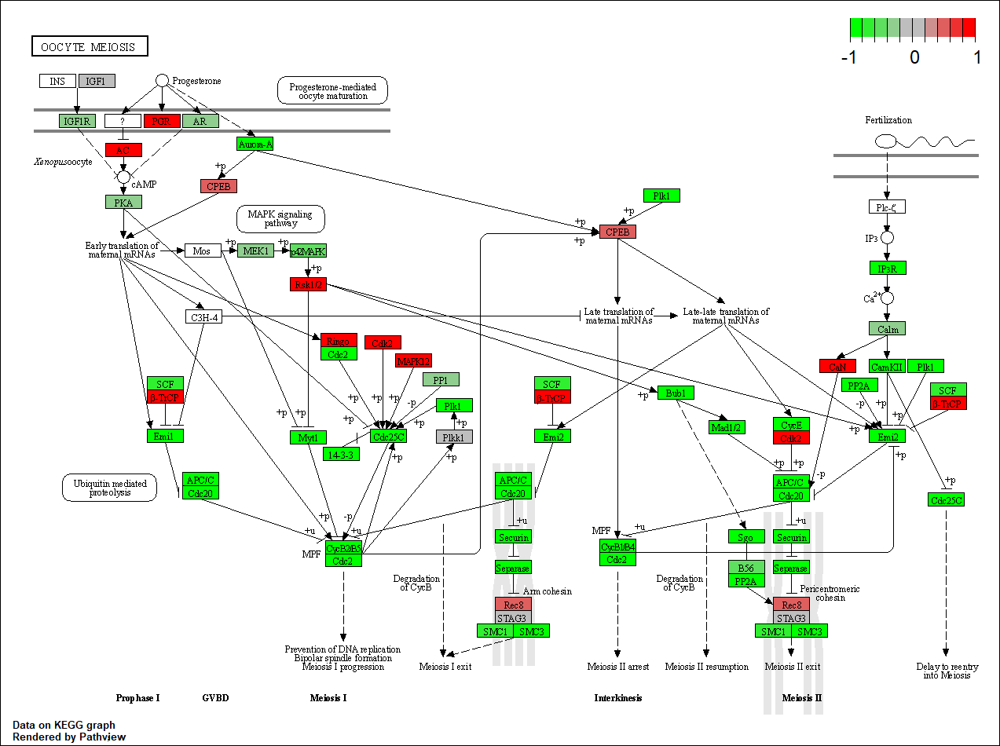

Class 13: RNASeq Mini-Project
================
Olivia Chu

## Input Data

The data for the hands-on session comes from GEO entry: GSE37704, which
is associated with the following publication:

> Trapnell C, Hendrickson DG, Sauvageau M, Goff L et al. “Differential
> analysis of gene regulation at transcript resolution with RNA-seq”.
> Nat Biotechnol 2013 Jan;31(1):46-53. PMID: 23222703

The authors report on differential analysis of lung fibroblasts in
response to loss of the developmental transcription factor HOXA1.

``` r
library(DESeq2)
```

    Loading required package: S4Vectors

    Loading required package: stats4

    Loading required package: BiocGenerics


    Attaching package: 'BiocGenerics'

    The following objects are masked from 'package:stats':

        IQR, mad, sd, var, xtabs

    The following objects are masked from 'package:base':

        anyDuplicated, aperm, append, as.data.frame, basename, cbind,
        colnames, dirname, do.call, duplicated, eval, evalq, Filter, Find,
        get, grep, grepl, intersect, is.unsorted, lapply, Map, mapply,
        match, mget, order, paste, pmax, pmax.int, pmin, pmin.int,
        Position, rank, rbind, Reduce, rownames, sapply, setdiff, sort,
        table, tapply, union, unique, unsplit, which.max, which.min


    Attaching package: 'S4Vectors'

    The following objects are masked from 'package:base':

        expand.grid, I, unname

    Loading required package: IRanges


    Attaching package: 'IRanges'

    The following object is masked from 'package:grDevices':

        windows

    Loading required package: GenomicRanges

    Loading required package: GenomeInfoDb

    Loading required package: SummarizedExperiment

    Loading required package: MatrixGenerics

    Loading required package: matrixStats


    Attaching package: 'MatrixGenerics'

    The following objects are masked from 'package:matrixStats':

        colAlls, colAnyNAs, colAnys, colAvgsPerRowSet, colCollapse,
        colCounts, colCummaxs, colCummins, colCumprods, colCumsums,
        colDiffs, colIQRDiffs, colIQRs, colLogSumExps, colMadDiffs,
        colMads, colMaxs, colMeans2, colMedians, colMins, colOrderStats,
        colProds, colQuantiles, colRanges, colRanks, colSdDiffs, colSds,
        colSums2, colTabulates, colVarDiffs, colVars, colWeightedMads,
        colWeightedMeans, colWeightedMedians, colWeightedSds,
        colWeightedVars, rowAlls, rowAnyNAs, rowAnys, rowAvgsPerColSet,
        rowCollapse, rowCounts, rowCummaxs, rowCummins, rowCumprods,
        rowCumsums, rowDiffs, rowIQRDiffs, rowIQRs, rowLogSumExps,
        rowMadDiffs, rowMads, rowMaxs, rowMeans2, rowMedians, rowMins,
        rowOrderStats, rowProds, rowQuantiles, rowRanges, rowRanks,
        rowSdDiffs, rowSds, rowSums2, rowTabulates, rowVarDiffs, rowVars,
        rowWeightedMads, rowWeightedMeans, rowWeightedMedians,
        rowWeightedSds, rowWeightedVars

    Loading required package: Biobase

    Welcome to Bioconductor

        Vignettes contain introductory material; view with
        'browseVignettes()'. To cite Bioconductor, see
        'citation("Biobase")', and for packages 'citation("pkgname")'.


    Attaching package: 'Biobase'

    The following object is masked from 'package:MatrixGenerics':

        rowMedians

    The following objects are masked from 'package:matrixStats':

        anyMissing, rowMedians

``` r
metaFile <- "GSE37704_metadata.csv"
countFile <- "GSE37704_featurecounts.csv"
```

``` r
# Import metadata and take a peak
colData = read.csv("GSE37704_metadata.csv", row.names=1)
head(colData)
```

                  condition
    SRR493366 control_sirna
    SRR493367 control_sirna
    SRR493368 control_sirna
    SRR493369      hoxa1_kd
    SRR493370      hoxa1_kd
    SRR493371      hoxa1_kd

``` r
# Import countdata
countDataTmp = read.csv(countFile, row.names=1)
head(countDataTmp)
```

                    length SRR493366 SRR493367 SRR493368 SRR493369 SRR493370
    ENSG00000186092    918         0         0         0         0         0
    ENSG00000279928    718         0         0         0         0         0
    ENSG00000279457   1982        23        28        29        29        28
    ENSG00000278566    939         0         0         0         0         0
    ENSG00000273547    939         0         0         0         0         0
    ENSG00000187634   3214       124       123       205       207       212
                    SRR493371
    ENSG00000186092         0
    ENSG00000279928         0
    ENSG00000279457        46
    ENSG00000278566         0
    ENSG00000273547         0
    ENSG00000187634       258

> Q1. Complete the code below to remove the troublesome first column
> from countData

``` r
# Note we need to remove the odd first $length col
countData <- as.matrix(countDataTmp[,-1])
head(countData)
```

                    SRR493366 SRR493367 SRR493368 SRR493369 SRR493370 SRR493371
    ENSG00000186092         0         0         0         0         0         0
    ENSG00000279928         0         0         0         0         0         0
    ENSG00000279457        23        28        29        29        28        46
    ENSG00000278566         0         0         0         0         0         0
    ENSG00000273547         0         0         0         0         0         0
    ENSG00000187634       124       123       205       207       212       258

> Q2. Complete the code below to filter countData to exclude genes
> (i.e. rows) where we have 0 read count across all samples
> (i.e. columns).

Check that my metadata and countData match.

``` r
rownames(colData) == colnames(countData)
```

    [1] TRUE TRUE TRUE TRUE TRUE TRUE

``` r
# Filter countData where you have 0 read count across all samples
to.keep <- rowSums(countData) != 0
countData <- countData[to.keep,]
nrow(countData)
```

    [1] 15975

``` r
head(countData)
```

                    SRR493366 SRR493367 SRR493368 SRR493369 SRR493370 SRR493371
    ENSG00000279457        23        28        29        29        28        46
    ENSG00000187634       124       123       205       207       212       258
    ENSG00000188976      1637      1831      2383      1226      1326      1504
    ENSG00000187961       120       153       180       236       255       357
    ENSG00000187583        24        48        65        44        48        64
    ENSG00000187642         4         9        16        14        16        16

# DESeq analysis

``` r
library(DESeq2)
```

Setup the object that DESeq needs for analysis with the lovely
long-winded function:

``` r
dds = DESeqDataSetFromMatrix(countData=countData,
                             colData=colData,
                             design=~condition)
```

    Warning in DESeqDataSet(se, design = design, ignoreRank): some variables in
    design formula are characters, converting to factors

Run the analysis:

``` r
dds <-DESeq(dds)
```

    estimating size factors

    estimating dispersions

    gene-wise dispersion estimates

    mean-dispersion relationship

    final dispersion estimates

    fitting model and testing

``` r
res <- results(dds)

res
```

    log2 fold change (MLE): condition hoxa1 kd vs control sirna 
    Wald test p-value: condition hoxa1 kd vs control sirna 
    DataFrame with 15975 rows and 6 columns
                     baseMean log2FoldChange     lfcSE       stat      pvalue
                    <numeric>      <numeric> <numeric>  <numeric>   <numeric>
    ENSG00000279457   29.9136      0.1792571 0.3248216   0.551863 5.81042e-01
    ENSG00000187634  183.2296      0.4264571 0.1402658   3.040350 2.36304e-03
    ENSG00000188976 1651.1881     -0.6927205 0.0548465 -12.630158 1.43990e-36
    ENSG00000187961  209.6379      0.7297556 0.1318599   5.534326 3.12428e-08
    ENSG00000187583   47.2551      0.0405765 0.2718928   0.149237 8.81366e-01
    ...                   ...            ...       ...        ...         ...
    ENSG00000273748  35.30265       0.674387  0.303666   2.220817 2.63633e-02
    ENSG00000278817   2.42302      -0.388988  1.130394  -0.344117 7.30758e-01
    ENSG00000278384   1.10180       0.332991  1.660261   0.200565 8.41039e-01
    ENSG00000276345  73.64496      -0.356181  0.207716  -1.714752 8.63908e-02
    ENSG00000271254 181.59590      -0.609667  0.141320  -4.314071 1.60276e-05
                           padj
                      <numeric>
    ENSG00000279457 6.86555e-01
    ENSG00000187634 5.15718e-03
    ENSG00000188976 1.76549e-35
    ENSG00000187961 1.13413e-07
    ENSG00000187583 9.19031e-01
    ...                     ...
    ENSG00000273748 4.79091e-02
    ENSG00000278817 8.09772e-01
    ENSG00000278384 8.92654e-01
    ENSG00000276345 1.39762e-01
    ENSG00000271254 4.53648e-05

Next, get results for the HoxA1 knockdown versus control siRNA (remember
that these were labeled as “hoxa1_kd” and “control_sirna” in our
original colData metaFile input to DESeq, you can check this above and
by running the `resultsNames(dds)` command).

``` r
res = results(dds, contrast=c("condition", "hoxa1_kd", "control_sirna"))
```

> Q3. Call the summary() function on your results to get a sense of how
> many genes are up- or down-regulated at the default 0.1 p-value
> cutoff.

``` r
summary(res)
```


    out of 15975 with nonzero total read count
    adjusted p-value < 0.1
    LFC > 0 (up)       : 4349, 27%
    LFC < 0 (down)     : 4396, 28%
    outliers [1]       : 0, 0%
    low counts [2]     : 1237, 7.7%
    (mean count < 0)
    [1] see 'cooksCutoff' argument of ?results
    [2] see 'independentFiltering' argument of ?results

# Volcano plot

``` r
plot( res$log2FoldChange, -log(res$padj) )
```


Make some colors to highlight the subset of genes with significant high
fold change values.

> Q4. Improve this plot by completing the below code, which adds color
> and axis labels.

``` r
mycols <- rep("gray", nrow(res) )

mycols[ abs(res$log2FoldChange) > 2 ] <- "blue"

mycols[ res$padj > 0.05 ] = "gray"

plot( res$log2FoldChange, -log(res$padj), col=mycols, xlab="Log2(FoldChange)", ylab="-Log(P-value)")

abline(v=c(-2,2), lty=2)
```



# Add gene annotation data

Our pathway analysis downstream will use KEGG pathways, and genes in
KEGG pathways are annotated with Entrez gene IDs. Let’s add them.

> Q5. Use the mapIDs() function multiple times to add SYMBOL, ENTREZID
> and GENENAME annotation to our results by completing the code below.

``` r
library("AnnotationDbi")
library("org.Hs.eg.db")
```

``` r
columns(org.Hs.eg.db)
```

     [1] "ACCNUM"       "ALIAS"        "ENSEMBL"      "ENSEMBLPROT"  "ENSEMBLTRANS"
     [6] "ENTREZID"     "ENZYME"       "EVIDENCE"     "EVIDENCEALL"  "GENENAME"    
    [11] "GENETYPE"     "GO"           "GOALL"        "IPI"          "MAP"         
    [16] "OMIM"         "ONTOLOGY"     "ONTOLOGYALL"  "PATH"         "PFAM"        
    [21] "PMID"         "PROSITE"      "REFSEQ"       "SYMBOL"       "UCSCKG"      
    [26] "UNIPROT"     

``` r
res$symbol = mapIds(org.Hs.eg.db,
                    keys=row.names(res), 
                    keytype="ENSEMBL",
                    column="SYMBOL",
                    multiVals="first")
```

    'select()' returned 1:many mapping between keys and columns

``` r
res$entrez = mapIds(org.Hs.eg.db,
                    keys=row.names(res),
                    keytype="ENSEMBL",
                    column="ENTREZID",
                    multiVals="first")
```

    'select()' returned 1:many mapping between keys and columns

``` r
res$name =   mapIds(org.Hs.eg.db,
                    keys=row.names(res),
                    keytype="ENSEMBL",
                    column="GENENAME",
                    multiVals="first")
```

    'select()' returned 1:many mapping between keys and columns

``` r
head(res, 10)
```

    log2 fold change (MLE): condition hoxa1_kd vs control_sirna 
    Wald test p-value: condition hoxa1 kd vs control sirna 
    DataFrame with 10 rows and 9 columns
                       baseMean log2FoldChange     lfcSE       stat      pvalue
                      <numeric>      <numeric> <numeric>  <numeric>   <numeric>
    ENSG00000279457   29.913579      0.1792571 0.3248216   0.551863 5.81042e-01
    ENSG00000187634  183.229650      0.4264571 0.1402658   3.040350 2.36304e-03
    ENSG00000188976 1651.188076     -0.6927205 0.0548465 -12.630158 1.43990e-36
    ENSG00000187961  209.637938      0.7297556 0.1318599   5.534326 3.12428e-08
    ENSG00000187583   47.255123      0.0405765 0.2718928   0.149237 8.81366e-01
    ENSG00000187642   11.979750      0.5428105 0.5215598   1.040744 2.97994e-01
    ENSG00000188290  108.922128      2.0570638 0.1969053  10.446970 1.51282e-25
    ENSG00000187608  350.716868      0.2573837 0.1027266   2.505522 1.22271e-02
    ENSG00000188157 9128.439422      0.3899088 0.0467163   8.346304 7.04321e-17
    ENSG00000237330    0.158192      0.7859552 4.0804729   0.192614 8.47261e-01
                           padj      symbol      entrez                   name
                      <numeric> <character> <character>            <character>
    ENSG00000279457 6.86555e-01          NA          NA                     NA
    ENSG00000187634 5.15718e-03      SAMD11      148398 sterile alpha motif ..
    ENSG00000188976 1.76549e-35       NOC2L       26155 NOC2 like nucleolar ..
    ENSG00000187961 1.13413e-07      KLHL17      339451 kelch like family me..
    ENSG00000187583 9.19031e-01     PLEKHN1       84069 pleckstrin homology ..
    ENSG00000187642 4.03379e-01       PERM1       84808 PPARGC1 and ESRR ind..
    ENSG00000188290 1.30538e-24        HES4       57801 hes family bHLH tran..
    ENSG00000187608 2.37452e-02       ISG15        9636 ISG15 ubiquitin like..
    ENSG00000188157 4.21963e-16        AGRN      375790                  agrin
    ENSG00000237330          NA      RNF223      401934 ring finger protein ..

> Q6. Finally for this section, let’s reorder these results by adjusted
> p-value and save them to a CSV file in your current project directory.

``` r
res = res[order(res$pvalue),]
write.csv(res, file="deseq_results.csv")
```

# Geneset enrichment analysis (pathway analysis)

``` r
# BiocManager::install( c("pathview", "gage", "gageData") )
library(pathview)
```

    ##############################################################################
    Pathview is an open source software package distributed under GNU General
    Public License version 3 (GPLv3). Details of GPLv3 is available at
    http://www.gnu.org/licenses/gpl-3.0.html. Particullary, users are required to
    formally cite the original Pathview paper (not just mention it) in publications
    or products. For details, do citation("pathview") within R.

    The pathview downloads and uses KEGG data. Non-academic uses may require a KEGG
    license agreement (details at http://www.kegg.jp/kegg/legal.html).
    ##############################################################################

``` r
library(gage)
```

``` r
library(gageData)

data(kegg.sets.hs)
data(sigmet.idx.hs)

# Focus on signaling and metabolic pathways only
kegg.sets.hs = kegg.sets.hs[sigmet.idx.hs]

# Examine the first 3 pathways
head(kegg.sets.hs, 3)
```

    $`hsa00232 Caffeine metabolism`
    [1] "10"   "1544" "1548" "1549" "1553" "7498" "9"   

    $`hsa00983 Drug metabolism - other enzymes`
     [1] "10"     "1066"   "10720"  "10941"  "151531" "1548"   "1549"   "1551"  
     [9] "1553"   "1576"   "1577"   "1806"   "1807"   "1890"   "221223" "2990"  
    [17] "3251"   "3614"   "3615"   "3704"   "51733"  "54490"  "54575"  "54576" 
    [25] "54577"  "54578"  "54579"  "54600"  "54657"  "54658"  "54659"  "54963" 
    [33] "574537" "64816"  "7083"   "7084"   "7172"   "7363"   "7364"   "7365"  
    [41] "7366"   "7367"   "7371"   "7372"   "7378"   "7498"   "79799"  "83549" 
    [49] "8824"   "8833"   "9"      "978"   

    $`hsa00230 Purine metabolism`
      [1] "100"    "10201"  "10606"  "10621"  "10622"  "10623"  "107"    "10714" 
      [9] "108"    "10846"  "109"    "111"    "11128"  "11164"  "112"    "113"   
     [17] "114"    "115"    "122481" "122622" "124583" "132"    "158"    "159"   
     [25] "1633"   "171568" "1716"   "196883" "203"    "204"    "205"    "221823"
     [33] "2272"   "22978"  "23649"  "246721" "25885"  "2618"   "26289"  "270"   
     [41] "271"    "27115"  "272"    "2766"   "2977"   "2982"   "2983"   "2984"  
     [49] "2986"   "2987"   "29922"  "3000"   "30833"  "30834"  "318"    "3251"  
     [57] "353"    "3614"   "3615"   "3704"   "377841" "471"    "4830"   "4831"  
     [65] "4832"   "4833"   "4860"   "4881"   "4882"   "4907"   "50484"  "50940" 
     [73] "51082"  "51251"  "51292"  "5136"   "5137"   "5138"   "5139"   "5140"  
     [81] "5141"   "5142"   "5143"   "5144"   "5145"   "5146"   "5147"   "5148"  
     [89] "5149"   "5150"   "5151"   "5152"   "5153"   "5158"   "5167"   "5169"  
     [97] "51728"  "5198"   "5236"   "5313"   "5315"   "53343"  "54107"  "5422"  
    [105] "5424"   "5425"   "5426"   "5427"   "5430"   "5431"   "5432"   "5433"  
    [113] "5434"   "5435"   "5436"   "5437"   "5438"   "5439"   "5440"   "5441"  
    [121] "5471"   "548644" "55276"  "5557"   "5558"   "55703"  "55811"  "55821" 
    [129] "5631"   "5634"   "56655"  "56953"  "56985"  "57804"  "58497"  "6240"  
    [137] "6241"   "64425"  "646625" "654364" "661"    "7498"   "8382"   "84172" 
    [145] "84265"  "84284"  "84618"  "8622"   "8654"   "87178"  "8833"   "9060"  
    [153] "9061"   "93034"  "953"    "9533"   "954"    "955"    "956"    "957"   
    [161] "9583"   "9615"  

The main `gage()` function requires a named vector of fold changes,
where the names of the values are the Entrez gene IDs.

Note that we used the `mapIDs()` function above to obtain Entrez gene
IDs and we have the fold change results from DESeq2 analysis.

``` r
foldchanges = res$log2FoldChange
names(foldchanges) = res$entrez
head(foldchanges)
```

         1266     54855      1465     51232      2034      2317 
    -2.422719  3.201955 -2.313738 -2.059631 -1.888019 -1.649792 

Now, let’s run the gage pathway analysis.

``` r
# Get the results
keggres = gage(foldchanges, gsets=kegg.sets.hs)
```

Let’s look at the object returned from `gage()`.

``` r
attributes(keggres)
```

    $names
    [1] "greater" "less"    "stats"  

Let’s look at the first few down (less) pathway results:

``` r
# Look at the first few down (less) pathways
head(keggres$less)
```

                                             p.geomean stat.mean        p.val
    hsa04110 Cell cycle                   8.995727e-06 -4.378644 8.995727e-06
    hsa03030 DNA replication              9.424076e-05 -3.951803 9.424076e-05
    hsa03013 RNA transport                1.375901e-03 -3.028500 1.375901e-03
    hsa03440 Homologous recombination     3.066756e-03 -2.852899 3.066756e-03
    hsa04114 Oocyte meiosis               3.784520e-03 -2.698128 3.784520e-03
    hsa00010 Glycolysis / Gluconeogenesis 8.961413e-03 -2.405398 8.961413e-03
                                                q.val set.size         exp1
    hsa04110 Cell cycle                   0.001448312      121 8.995727e-06
    hsa03030 DNA replication              0.007586381       36 9.424076e-05
    hsa03013 RNA transport                0.073840037      144 1.375901e-03
    hsa03440 Homologous recombination     0.121861535       28 3.066756e-03
    hsa04114 Oocyte meiosis               0.121861535      102 3.784520e-03
    hsa00010 Glycolysis / Gluconeogenesis 0.212222694       53 8.961413e-03

Now, let’s try out the `pathview()` function from the pathview package
to make a pathway plot with our RNA-Seq expression results shown in
color.

To begin with, let’s manually supply a pathway.id (namely the first part
of the “hsa04110 Cell cycle”) that we could see from the print out
above.

``` r
pathview(gene.data=foldchanges, pathway.id="hsa04110")
```

    'select()' returned 1:1 mapping between keys and columns

    Info: Working in directory C:/Users/Olivia Chu/Documents/UCSD/Senior (2022-23)/Winter 2023/BIMM 143 (Grant)/bimm143_github/class13

    Info: Writing image file hsa04110.pathview.png

Let’s add this image to my document.


Now, let’s process our results a bit more to automatically pull out the
top 5 upregulated pathways, then further process that just to get the
pathway IDs needed by the `pathview()` function. We’ll use these KEGG
pathway IDs for pathview plotting below.

``` r
## Focus on top 5 upregulated pathways here for demo purposes only
keggrespathways <- rownames(keggres$greater)[1:5]

# Extract the 8 character long IDs part of each string
keggresids = substr(keggrespathways, start=1, stop=8)
keggresids
```

    [1] "hsa04640" "hsa04630" "hsa00140" "hsa04142" "hsa04330"

Finally, let’s pass these IDs in keggresids to the `pathview()` function
to draw plots for all the top 5 pathways.

``` r
pathview(gene.data=foldchanges, pathway.id=keggresids, species="hsa")
```

    'select()' returned 1:1 mapping between keys and columns

    Info: Working in directory C:/Users/Olivia Chu/Documents/UCSD/Senior (2022-23)/Winter 2023/BIMM 143 (Grant)/bimm143_github/class13

    Info: Writing image file hsa04640.pathview.png

    'select()' returned 1:1 mapping between keys and columns

    Info: Working in directory C:/Users/Olivia Chu/Documents/UCSD/Senior (2022-23)/Winter 2023/BIMM 143 (Grant)/bimm143_github/class13

    Info: Writing image file hsa04630.pathview.png

    'select()' returned 1:1 mapping between keys and columns

    Info: Working in directory C:/Users/Olivia Chu/Documents/UCSD/Senior (2022-23)/Winter 2023/BIMM 143 (Grant)/bimm143_github/class13

    Info: Writing image file hsa00140.pathview.png

    'select()' returned 1:1 mapping between keys and columns

    Info: Working in directory C:/Users/Olivia Chu/Documents/UCSD/Senior (2022-23)/Winter 2023/BIMM 143 (Grant)/bimm143_github/class13

    Info: Writing image file hsa04142.pathview.png

    Info: some node width is different from others, and hence adjusted!

    'select()' returned 1:1 mapping between keys and columns

    Info: Working in directory C:/Users/Olivia Chu/Documents/UCSD/Senior (2022-23)/Winter 2023/BIMM 143 (Grant)/bimm143_github/class13

    Info: Writing image file hsa04330.pathview.png










> Q7. Can you do the same procedure as above to plot the pathview
> figures for the top 5 down-regulated pathways?

``` r
## Focus on top 5 down-regulated pathways here for demo purposes only
keggrespathwaysL <- rownames(keggres$less)[1:5]

# Extract the 8 character long IDs part of each string
keggresidsL = substr(keggrespathwaysL, start=1, stop=8)
keggresidsL
```

    [1] "hsa04110" "hsa03030" "hsa03013" "hsa03440" "hsa04114"

``` r
pathview(gene.data=foldchanges, pathway.id=keggresidsL, species="hsa")
```

    'select()' returned 1:1 mapping between keys and columns

    Info: Working in directory C:/Users/Olivia Chu/Documents/UCSD/Senior (2022-23)/Winter 2023/BIMM 143 (Grant)/bimm143_github/class13

    Info: Writing image file hsa04110.pathview.png

    'select()' returned 1:1 mapping between keys and columns

    Info: Working in directory C:/Users/Olivia Chu/Documents/UCSD/Senior (2022-23)/Winter 2023/BIMM 143 (Grant)/bimm143_github/class13

    Info: Writing image file hsa03030.pathview.png

    'select()' returned 1:1 mapping between keys and columns

    Info: Working in directory C:/Users/Olivia Chu/Documents/UCSD/Senior (2022-23)/Winter 2023/BIMM 143 (Grant)/bimm143_github/class13

    Info: Writing image file hsa03013.pathview.png

    'select()' returned 1:1 mapping between keys and columns

    Info: Working in directory C:/Users/Olivia Chu/Documents/UCSD/Senior (2022-23)/Winter 2023/BIMM 143 (Grant)/bimm143_github/class13

    Info: Writing image file hsa03440.pathview.png

    'select()' returned 1:1 mapping between keys and columns

    Info: Working in directory C:/Users/Olivia Chu/Documents/UCSD/Senior (2022-23)/Winter 2023/BIMM 143 (Grant)/bimm143_github/class13

    Info: Writing image file hsa04114.pathview.png








# Gene Ontology (GO)

Let’s focus on BP (a.k.a Biological Process).

``` r
data(go.sets.hs)
data(go.subs.hs)

# Focus on Biological Process subset of GO
gobpsets = go.sets.hs[go.subs.hs$BP]

gobpres = gage(foldchanges, gsets=gobpsets, same.dir=TRUE)

lapply(gobpres, head)
```

    $greater
                                                 p.geomean stat.mean        p.val
    GO:0007156 homophilic cell adhesion       8.519724e-05  3.824205 8.519724e-05
    GO:0002009 morphogenesis of an epithelium 1.396681e-04  3.653886 1.396681e-04
    GO:0048729 tissue morphogenesis           1.432451e-04  3.643242 1.432451e-04
    GO:0007610 behavior                       2.195494e-04  3.530241 2.195494e-04
    GO:0060562 epithelial tube morphogenesis  5.932837e-04  3.261376 5.932837e-04
    GO:0035295 tube development               5.953254e-04  3.253665 5.953254e-04
                                                  q.val set.size         exp1
    GO:0007156 homophilic cell adhesion       0.1951953      113 8.519724e-05
    GO:0002009 morphogenesis of an epithelium 0.1951953      339 1.396681e-04
    GO:0048729 tissue morphogenesis           0.1951953      424 1.432451e-04
    GO:0007610 behavior                       0.2243795      427 2.195494e-04
    GO:0060562 epithelial tube morphogenesis  0.3711390      257 5.932837e-04
    GO:0035295 tube development               0.3711390      391 5.953254e-04

    $less
                                                p.geomean stat.mean        p.val
    GO:0048285 organelle fission             1.536227e-15 -8.063910 1.536227e-15
    GO:0000280 nuclear division              4.286961e-15 -7.939217 4.286961e-15
    GO:0007067 mitosis                       4.286961e-15 -7.939217 4.286961e-15
    GO:0000087 M phase of mitotic cell cycle 1.169934e-14 -7.797496 1.169934e-14
    GO:0007059 chromosome segregation        2.028624e-11 -6.878340 2.028624e-11
    GO:0000236 mitotic prometaphase          1.729553e-10 -6.695966 1.729553e-10
                                                    q.val set.size         exp1
    GO:0048285 organelle fission             5.841698e-12      376 1.536227e-15
    GO:0000280 nuclear division              5.841698e-12      352 4.286961e-15
    GO:0007067 mitosis                       5.841698e-12      352 4.286961e-15
    GO:0000087 M phase of mitotic cell cycle 1.195672e-11      362 1.169934e-14
    GO:0007059 chromosome segregation        1.658603e-08      142 2.028624e-11
    GO:0000236 mitotic prometaphase          1.178402e-07       84 1.729553e-10

    $stats
                                              stat.mean     exp1
    GO:0007156 homophilic cell adhesion        3.824205 3.824205
    GO:0002009 morphogenesis of an epithelium  3.653886 3.653886
    GO:0048729 tissue morphogenesis            3.643242 3.643242
    GO:0007610 behavior                        3.530241 3.530241
    GO:0060562 epithelial tube morphogenesis   3.261376 3.261376
    GO:0035295 tube development                3.253665 3.253665

# Reactome Analysis

Let’s now conduct over-representation enrichment analysis and
pathway-topology analysis with Reactome using the previous list of
significant genes generated from our differential expression results
above.

First, Using R, output the list of significant genes at the 0.05 level
as a plain text file:

``` r
sig_genes <- res[res$padj <= 0.05 & !is.na(res$padj), "symbol"]
print(paste("Total number of significant genes:", length(sig_genes)))
```

    [1] "Total number of significant genes: 8147"

``` r
write.table(sig_genes, file="significant_genes.txt", row.names=FALSE, col.names=FALSE, quote=FALSE)
```

> Q8. What pathway has the most significant “Entities p-value”? Do the
> most significant pathways listed match your previous KEGG results?
> What factors could cause differences between the two methods?

The pathway with the most significant “Entities p-value” is
Endosomal/Vacuolar pathway. No, not many most significant pathways
listed match my previous KEGG results.

``` r
head(keggres$less)
```

                                             p.geomean stat.mean        p.val
    hsa04110 Cell cycle                   8.995727e-06 -4.378644 8.995727e-06
    hsa03030 DNA replication              9.424076e-05 -3.951803 9.424076e-05
    hsa03013 RNA transport                1.375901e-03 -3.028500 1.375901e-03
    hsa03440 Homologous recombination     3.066756e-03 -2.852899 3.066756e-03
    hsa04114 Oocyte meiosis               3.784520e-03 -2.698128 3.784520e-03
    hsa00010 Glycolysis / Gluconeogenesis 8.961413e-03 -2.405398 8.961413e-03
                                                q.val set.size         exp1
    hsa04110 Cell cycle                   0.001448312      121 8.995727e-06
    hsa03030 DNA replication              0.007586381       36 9.424076e-05
    hsa03013 RNA transport                0.073840037      144 1.375901e-03
    hsa03440 Homologous recombination     0.121861535       28 3.066756e-03
    hsa04114 Oocyte meiosis               0.121861535      102 3.784520e-03
    hsa00010 Glycolysis / Gluconeogenesis 0.212222694       53 8.961413e-03
