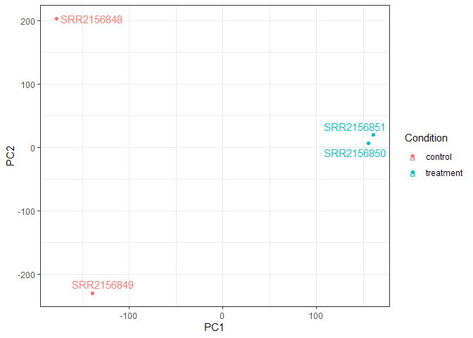
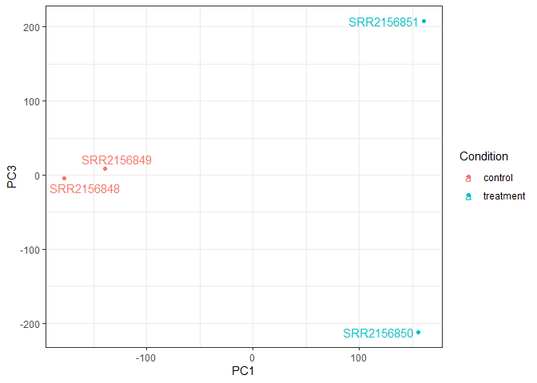

Class 16 Extra Credit PCA
================
Olivia Chu

## Downstream Analysis

We can now use R and Bioconductor tools to further explore this large
scale data set.

There is an R function called `tximport()` in the tximport package,
which enables straightforward import of Kallisto results

With each sample having its own directory containing the Kallisto
output, we can import the transcript count estimates into R using:

``` r
# BiocManager::install("tximport")

library(tximport)
```

``` r
# setup the folder and file names to read
folders <- dir(pattern="SRR21568*")
samples <- sub("_quant", "", folders)
files <- file.path( folders, "abundance.h5" )
names(files) <- samples

txi.kallisto <- tximport(files, type = "kallisto", txOut = TRUE)
```

    1 2 3 4 

``` r
head(txi.kallisto$counts)
```

                    SRR2156848 SRR2156849 SRR2156850 SRR2156851
    ENST00000539570          0          0    0.00000          0
    ENST00000576455          0          0    2.62037          0
    ENST00000510508          0          0    0.00000          0
    ENST00000474471          0          1    1.00000          0
    ENST00000381700          0          0    0.00000          0
    ENST00000445946          0          0    0.00000          0

We can see how many transcripts we have for each sample since we now
have our estimated transcript counts for each sample:

``` r
colSums(txi.kallisto$counts)
```

    SRR2156848 SRR2156849 SRR2156850 SRR2156851 
       2563611    2600800    2372309    2111474 

We can also check to see how many transcripts are detected in at least
one sample:

``` r
sum(rowSums(txi.kallisto$counts)>0)
```

    [1] 94561

We should filter out annotated transcripts with no reads before doing
subsequent analysis:

``` r
to.keep <- rowSums(txi.kallisto$counts) > 0
kset.nonzero <- txi.kallisto$counts[to.keep,]
```

We should also filter out transcripts with no change over the samples:

``` r
keep2 <- apply(kset.nonzero,1,sd)>0
x <- kset.nonzero[keep2,]
```

# Principal Component Analysis

We can now apply any exploratory analysis technique to this counts
matrix. We will perform a PCA of the transcriptomic profiles of these
samples.

We will compute the principal components, centering and scaling each
transcript’s measured levels so that each feature contributes equally to
the PCA:

``` r
pca <- prcomp(t(x), scale=TRUE)

summary(pca)
```

    Importance of components:
                                PC1      PC2      PC3   PC4
    Standard deviation     183.6379 177.3605 171.3020 1e+00
    Proportion of Variance   0.3568   0.3328   0.3104 1e-05
    Cumulative Proportion    0.3568   0.6895   1.0000 1e+00

We can use the first two principal components as a coordinate system for
visualizing the summarized transcriptomic profiles of each sample:

``` r
plot(pca$x[,1], pca$x[,2],
     col=c("cornflowerblue","cornflowerblue","hotpink","hotpink"),
     xlab="PC1", ylab="PC2", pch=16)
```


We will make similar figures for PC1 vs PC2, PC1 vs PC3, and PC2 vs PC3
using ggplot.

``` r
library(ggplot2)
library(ggrepel)

# Make metadata object for the samples
colData <- data.frame(condition = factor(rep(c("control", "treatment"), each = 2)))
rownames(colData) <- colnames(txi.kallisto$counts)

# Make the data.frame for ggplot 
y <- as.data.frame(pca$x)
y$Condition <- as.factor(colData$condition)

# PC1 vs PC2
ggplot(y) +
  aes(PC1, PC2, col=Condition) +
  geom_point() +
  geom_text_repel(label=rownames(y)) +
  theme_bw()
```



``` r
# PC1 vs PC3
ggplot(y) +
  aes(PC1, PC3, col=Condition) +
  geom_point() +
  geom_text_repel(label=rownames(y)) +
  theme_bw()
```



``` r
# PC2 vs PC3
ggplot(y) +
  aes(PC2, PC3, col=Condition) +
  geom_point() +
  geom_text_repel(label=rownames(y)) +
  theme_bw()
```


From these plots, we can conclude that…

1)  PC1 separates the two control samples (SRR2156848 and SRR2156849)
    from the two enhancer-targeting CRISPR-Cas9 samples (SRR2156850 and
    SRR2156851).

2)  PC2 separated the two control samples from each other.

3)  PC3 separates the two-enhancer-targeting CRIPSR samples from each
    other.

This could be investigated further to see which genes result in these
separation patterns. It is also at least slightly reassuring, implying
that there are considerable differences between the treated and control
samples.
