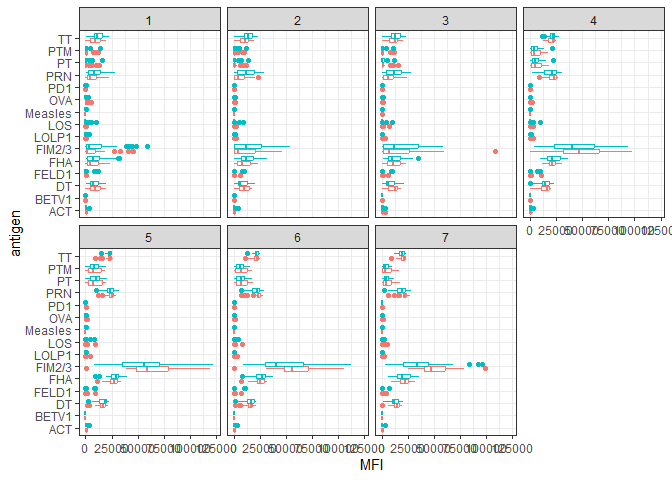
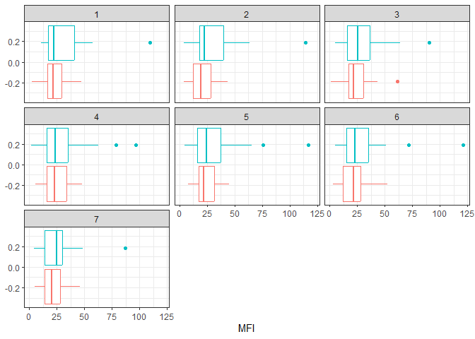

Class 19: Investigating Pertussis Resurgence
================
Olivia Chu

# Investigating pertussis cases by year

The CDC tracks cases of Pertussis in the US. We can get their data via
web-scrapping.

> Q1. With the help of the R “addin” package datapasta, assign the CDC
> pertussis case number data to a data frame called cdc and use ggplot
> to make a plot of cases numbers over time.

``` r
library(ggplot2)

baseplot <- ggplot(cdc) +
  aes(Year, Cases) + 
  geom_point() +
  geom_line() + 
  labs(title="Cases of Pertussis in US from 1920 to 2019",
      subtitle="Data from CDC")

baseplot
```


# A tale of two vaccines (wP a& aP)

> Q2. Using the ggplot geom_vline() function, add lines to your previous
> plot for the 1946 introduction of the wP vaccine and the 1996 switch
> to aP vaccine (see example in the hint below). What do you notice?

``` r
baseplot + 
  geom_vline(xintercept=1946, col="cornflowerblue", linetype=2) +
  geom_text(aes(1950, 2.8e+05), label="wP", col="cornflowerblue", size=3) +
  geom_vline(xintercept=1996, col="hotpink", linetype=2) +
  geom_text(aes(2000, 2.8e+05), label="aP", col="hotpink", size=3)
```


When the wP vaccine was introduced in 1946, there was a significant drop
in pertussis cases. The number of cases remained low up until the
introduction of the aP vaccine in 1996. After the switch to the aP
vaccine, we can observe a slight increase in pertussis cases.

> Q3. Describe what happened after the introduction of the aP vaccine?
> Do you have a possible explanation for the observed trend?

After the switch to the aP vaccine, we can see that although case
numbers remained low, there was a slight increase in pertussis cases.
Possible causes for this increase include: sensitive PCR testing,
vaccine hesitancy (people may not have wanted the aP vaccine after the
success of the wP vaccine), bacterial evolution (the aP vaccine was less
effective against pertussis), and less immunity within the community.

**Key-Point:** Despite high levels of acellular pertussis (aP)
vaccination, the United States and other countries are now experiencing
a significant resurgence in pertussis cases with large outbreaks now
once again a major public health concern.

# The CMI-PB project

The CMI-PB project is collecting data on aP and wP individuals and their
immune response to infection and/or booster shots.

CMI-PB returns data from its API in JSON format (like most APIs). We
will use the jsonlite package to get data from this API.

``` r
library(jsonlite)
```

``` r
subject <- read_json("http://cmi-pb.org/api/subject", 
                     simplifyVector = TRUE)

head(subject)
```

      subject_id infancy_vac biological_sex              ethnicity  race
    1          1          wP         Female Not Hispanic or Latino White
    2          2          wP         Female Not Hispanic or Latino White
    3          3          wP         Female                Unknown White
    4          4          wP           Male Not Hispanic or Latino Asian
    5          5          wP           Male Not Hispanic or Latino Asian
    6          6          wP         Female Not Hispanic or Latino White
      year_of_birth date_of_boost      dataset
    1    1986-01-01    2016-09-12 2020_dataset
    2    1968-01-01    2019-01-28 2020_dataset
    3    1983-01-01    2016-10-10 2020_dataset
    4    1988-01-01    2016-08-29 2020_dataset
    5    1991-01-01    2016-08-29 2020_dataset
    6    1988-01-01    2016-10-10 2020_dataset

> Q4. How may aP and wP infancy vaccinated subjects are in the dataset?

``` r
table(subject$infancy_vac)
```


    aP wP 
    47 49 

There are 47 aP and 49 wP infancy vaccinated subjects in the dataset.

> Q5. How many Male and Female subjects/patients are in the dataset?

``` r
table(subject$biological_sex)
```


    Female   Male 
        66     30 

There are 30 Male and 66 Female subjects/patients in this dataset.

> Q6. What is the breakdown of race and biological sex (e.g. number of
> Asian females, White males etc…)?

``` r
table(subject$race, subject$biological_sex)
```

                                               
                                                Female Male
      American Indian/Alaska Native                  0    1
      Asian                                         18    9
      Black or African American                      2    0
      More Than One Race                             8    2
      Native Hawaiian or Other Pacific Islander      1    1
      Unknown or Not Reported                       10    4
      White                                         27   13

See table above for race and biological sex breakdown.

# Side-Note: Working with dates

``` r
library(lubridate)
```


    Attaching package: 'lubridate'

    The following objects are masked from 'package:base':

        date, intersect, setdiff, union

> Q7. Using this approach determine (i) the average age of wP
> individuals, (ii) the average age of aP individuals; and (iii) are
> they significantly different?

First, calculate the age in years of all subjects:

``` r
age_days <- today() - ymd(subject$year_of_birth)
age_years <- time_length(age_days, "years")
subject$age <- age_years
```

Next, find the average age of all individuals:

``` r
mean(subject$age)
```

    [1] 31.05627

Calculate the average age of wP and aP individuals:

``` r
library(dplyr)
```


    Attaching package: 'dplyr'

    The following objects are masked from 'package:stats':

        filter, lag

    The following objects are masked from 'package:base':

        intersect, setdiff, setequal, union

``` r
wp_age <- filter(subject, infancy_vac == "wP")$age
ap_age <- filter(subject, infancy_vac == "aP")$age

mean(wp_age)
```

    [1] 36.36553

``` r
mean(ap_age)
```

    [1] 25.52108

The average age of wP individuals is 36.36 years, and the average age of
aP individuals is 26.51 years.

``` r
# T-test
t.test(wp_age, ap_age)
```


        Welch Two Sample t-test

    data:  wp_age and ap_age
    t = 12.092, df = 51.082, p-value < 2.2e-16
    alternative hypothesis: true difference in means is not equal to 0
    95 percent confidence interval:
      9.044045 12.644857
    sample estimates:
    mean of x mean of y 
     36.36553  25.52108 

This data is significant because my calculated p-value from my t-test is
smaller than 0.05.

> Q8. Determine the age of all individuals at time of boost?

``` r
int <- ymd(subject$date_of_boost) - ymd(subject$year_of_birth)

age_at_boost <- time_length(int, "year")

age_at_boost
```

     [1] 30.69678 51.07461 33.77413 28.65982 25.65914 28.77481 35.84942 34.14921
     [9] 20.56400 34.56263 30.65845 34.56263 19.56194 23.61944 27.61944 29.56331
    [17] 36.69815 19.65777 22.73511 32.26557 25.90007 23.90144 25.90007 28.91992
    [25] 42.92129 47.07461 47.07461 29.07324 21.07324 21.07324 28.15058 24.15058
    [33] 24.15058 21.14990 21.14990 31.20876 26.20671 32.20808 27.20876 26.20671
    [41] 21.20739 20.26557 22.26420 19.32375 21.32238 19.32375 19.32375 22.41752
    [49] 20.41889 21.41821 19.47707 23.47707 20.47639 21.47570 19.47707 35.65777
    [57] 33.65914 31.65777 25.73580 24.70089 28.70089 33.73580 19.73443 34.73511
    [65] 19.73443 28.73648 27.73443 19.81109 26.77344 33.81246 25.77413 19.81109
    [73] 18.85010 19.81109 31.81109 22.81177 31.84942 19.84942 18.85010 18.85010
    [81] 19.90691 18.85010 20.90897 19.04449 20.04381 19.90691 19.90691 19.00616
    [89] 19.00616 20.04381 20.04381 20.07940 21.08145 20.07940 20.07940 20.07940

The value “age_at_boost” lists the age of all the individuals at the
time of their boost.

> Q9. With the help of a faceted boxplot (see below), do you think these
> two groups are significantly different?

``` r
ggplot(subject) +
  aes(time_length(age, "year"),
      fill=as.factor(infancy_vac)) +
  geom_histogram(show.legend=FALSE) +
  facet_wrap(vars(infancy_vac), nrow=2) 
```

    `stat_bin()` using `bins = 30`. Pick better value with `binwidth`.


Yes, based on the facted boxplot, I do think these two groups are
significantly different due to the vastly different counts
distributions. the faceted boxplot for aP is skewed towards the left
whereas the faceted boxplot for wP is more spread out and in the middle
and towards the right.

# Joining multiple tables

Read the specimen and ab_titer tables into R and store the data as
specimen and titer named data frames.

``` r
# Complete the API URLs...
specimen <- read_json("http://cmi-pb.org/api/specimen", simplifyVector = TRUE) 

titer <- read_json("http://cmi-pb.org/api/ab_titer", simplifyVector = TRUE) 
```

``` r
head(specimen)
```

      specimen_id subject_id actual_day_relative_to_boost
    1           1          1                           -3
    2           2          1                          736
    3           3          1                            1
    4           4          1                            3
    5           5          1                            7
    6           6          1                           11
      planned_day_relative_to_boost specimen_type visit
    1                             0         Blood     1
    2                           736         Blood    10
    3                             1         Blood     2
    4                             3         Blood     3
    5                             7         Blood     4
    6                            14         Blood     5

``` r
head(titer)
```

      specimen_id isotype is_antigen_specific antigen        MFI MFI_normalised
    1           1     IgE               FALSE   Total 1110.21154       2.493425
    2           1     IgE               FALSE   Total 2708.91616       2.493425
    3           1     IgG                TRUE      PT   68.56614       3.736992
    4           1     IgG                TRUE     PRN  332.12718       2.602350
    5           1     IgG                TRUE     FHA 1887.12263      34.050956
    6           1     IgE                TRUE     ACT    0.10000       1.000000
       unit lower_limit_of_detection
    1 UG/ML                 2.096133
    2 IU/ML                29.170000
    3 IU/ML                 0.530000
    4 IU/ML                 6.205949
    5 IU/ML                 4.679535
    6 IU/ML                 2.816431

To know whether a given specimen_id comes from an aP or wP individual,
we need to link (a.k.a. “join” or merge) our specimen and subject data
frames. The excellent dplyr package (that we have used previously) has a
family of `join()` functions that can help us with this common task:

> Q9. Complete the code to join specimen and subject tables to make a
> new merged data frame containing all specimen records along with their
> associated subject details:

``` r
meta <- inner_join(specimen, subject)
```

    Joining with `by = join_by(subject_id)`

``` r
dim(meta)
```

    [1] 729  14

``` r
head(meta)
```

      specimen_id subject_id actual_day_relative_to_boost
    1           1          1                           -3
    2           2          1                          736
    3           3          1                            1
    4           4          1                            3
    5           5          1                            7
    6           6          1                           11
      planned_day_relative_to_boost specimen_type visit infancy_vac biological_sex
    1                             0         Blood     1          wP         Female
    2                           736         Blood    10          wP         Female
    3                             1         Blood     2          wP         Female
    4                             3         Blood     3          wP         Female
    5                             7         Blood     4          wP         Female
    6                            14         Blood     5          wP         Female
                   ethnicity  race year_of_birth date_of_boost      dataset
    1 Not Hispanic or Latino White    1986-01-01    2016-09-12 2020_dataset
    2 Not Hispanic or Latino White    1986-01-01    2016-09-12 2020_dataset
    3 Not Hispanic or Latino White    1986-01-01    2016-09-12 2020_dataset
    4 Not Hispanic or Latino White    1986-01-01    2016-09-12 2020_dataset
    5 Not Hispanic or Latino White    1986-01-01    2016-09-12 2020_dataset
    6 Not Hispanic or Latino White    1986-01-01    2016-09-12 2020_dataset
           age
    1 37.20192
    2 37.20192
    3 37.20192
    4 37.20192
    5 37.20192
    6 37.20192

> Q10. Now using the same procedure, join meta with titer data so we can
> further analyze this data in terms of time of visit aP/wP, male/female
> etc.

``` r
abdata <- inner_join(titer, meta)
```

    Joining with `by = join_by(specimen_id)`

``` r
dim(abdata)
```

    [1] 32675    21

> Q11. How many specimens (i.e. entries in abdata) do we have for each
> isotype?

``` r
table(abdata$isotype)
```


     IgE  IgG IgG1 IgG2 IgG3 IgG4 
    6698 1413 6141 6141 6141 6141 

We have 6698 IgE, 1413 IgG, and 6141 of IgG1, IgG2, IgG3, and IgG4 each.

> Q12. What do you notice about the number of visit 8 specimens compared
> to other visits?

``` r
table(abdata$visit)
```


       1    2    3    4    5    6    7    8 
    5795 4640 4640 4640 4640 4320 3920   80 

The number of visit 8 specimens is very low compared to other visits.
The number of specimens had a sharp decreased from the 3000’s to 80
during visit 8. This low number could be because data is still being
collected and this project is still ongoing.

# Examine IgG1 Ab titer levels

Now, use our joined/merged/linked abdata dataset `filter()` for IgG1
isotype and exclude the small number of visit 8 entries.

``` r
ig1 <- abdata %>% filter(isotype == "IgG1", visit!=8)
head(ig1)
```

      specimen_id isotype is_antigen_specific antigen        MFI MFI_normalised
    1           1    IgG1                TRUE     ACT 274.355068      0.6928058
    2           1    IgG1                TRUE     LOS  10.974026      2.1645083
    3           1    IgG1                TRUE   FELD1   1.448796      0.8080941
    4           1    IgG1                TRUE   BETV1   0.100000      1.0000000
    5           1    IgG1                TRUE   LOLP1   0.100000      1.0000000
    6           1    IgG1                TRUE Measles  36.277417      1.6638332
       unit lower_limit_of_detection subject_id actual_day_relative_to_boost
    1 IU/ML                 3.848750          1                           -3
    2 IU/ML                 4.357917          1                           -3
    3 IU/ML                 2.699944          1                           -3
    4 IU/ML                 1.734784          1                           -3
    5 IU/ML                 2.550606          1                           -3
    6 IU/ML                 4.438966          1                           -3
      planned_day_relative_to_boost specimen_type visit infancy_vac biological_sex
    1                             0         Blood     1          wP         Female
    2                             0         Blood     1          wP         Female
    3                             0         Blood     1          wP         Female
    4                             0         Blood     1          wP         Female
    5                             0         Blood     1          wP         Female
    6                             0         Blood     1          wP         Female
                   ethnicity  race year_of_birth date_of_boost      dataset
    1 Not Hispanic or Latino White    1986-01-01    2016-09-12 2020_dataset
    2 Not Hispanic or Latino White    1986-01-01    2016-09-12 2020_dataset
    3 Not Hispanic or Latino White    1986-01-01    2016-09-12 2020_dataset
    4 Not Hispanic or Latino White    1986-01-01    2016-09-12 2020_dataset
    5 Not Hispanic or Latino White    1986-01-01    2016-09-12 2020_dataset
    6 Not Hispanic or Latino White    1986-01-01    2016-09-12 2020_dataset
           age
    1 37.20192
    2 37.20192
    3 37.20192
    4 37.20192
    5 37.20192
    6 37.20192

> Q13. Complete the following code to make a summary boxplot of Ab titer
> levels for all antigens:

``` r
ggplot(ig1) +
  aes(MFI, antigen) +
  geom_boxplot() + 
  facet_wrap(vars(visit), nrow=2)
```


> Q14. What antigens show differences in the level of IgG1 antibody
> titers recognizing them over time? Why these and not others?

The antigens that show differences in the level of IgG1 antibody titers
recognizing them over time are PT, FIM2/3, and FHA. These antigens show
differences (and not others) because they are all in the aP vaccine.

Additional antigens that show differences include TT, PRN, and DT.

We can attempt to examine differences between wP and aP here by setting
color and/or facet values of the plot to include infancy_vac status

``` r
ggplot(ig1) +
  aes(MFI, antigen, col=infancy_vac ) +
  geom_boxplot(show.legend = FALSE) + 
  facet_wrap(vars(visit), nrow=2) +
  theme_bw()
```



Another version of this plot adding infancy_vac to the faceting:

``` r
ggplot(ig1) +
  aes(MFI, antigen, col=infancy_vac ) +
  geom_boxplot(show.legend = FALSE) + 
  facet_wrap(vars(infancy_vac, visit), nrow=2)
```


> Q15. Filter to pull out only two specific antigens for analysis and
> create a boxplot for each. You can chose any you like. Below I picked
> a “control” antigen (“Measles”, that is not in our vaccines) and a
> clear antigen of interest (“FIM2/3”, extra-cellular fimbriae proteins
> from B. pertussis that participate in substrate attachment).

``` r
filter(ig1, antigen=="Measles") %>%
  ggplot() +
  aes(MFI, col=infancy_vac) +
  geom_boxplot(show.legend = FALSE) +
  facet_wrap(vars(visit)) +
  theme_bw()
```



> and the same for antigen==“FIM2/3”

``` r
filter(ig1, antigen=="FIM2/3") %>%
  ggplot() +
  aes(MFI, col=infancy_vac) +
  geom_boxplot(show.legend = FALSE) +
  facet_wrap(vars(visit)) +
  theme_bw()
```


> Q16. What do you notice about these two antigens time course and the
> FIM2/3 data in particular?

Compared to Measles, the FIM2/3 antigen sees a much more rapid increase
in IgG1 antibody titers over time (this can also be observed by the
larger values on the y-axis of FIM2/3). The Measles antigen saw a very
small (maybe even neglible) change in antibody titers over this same
time course.

> Q17. Do you see any clear difference in aP vs. wP responses?

There is a clear difference in aP (red) and wP (teal) responses
(i.e. antigen levels).

When looking at Measles, wp response was greater than that of aP
response. Over time, aP response increased and was able to catch up with
wP response.

When looking at the FIM2/3 plot, we can see that the wP response was
much higher than aP response, with a steady increase in antigen levels
from visit 1 to 3. However, from visit 4 to visit 7, aP response saw a
much greater/rapid increase in antigen levels and it eventually
overtakes wP response by the end of visit 7.

# Obtaining CMI-PB RNASeq data

We will read available RNA-Seq data for this gene into R and investigate
the time course of its gene expression values.

``` r
url <- "https://www.cmi-pb.org/api/v2/rnaseq?versioned_ensembl_gene_id=eq.ENSG00000211896.7"

rna <- read_json(url, simplifyVector = TRUE)
```

To facilitate further analysis, we need to “join” the rna expression
data with our metadata meta, which is itself a join of sample and
specimen data. This will allow us to look at this genes TPM expression
values over aP/wP status and at different visits (i.e. times):

``` r
#meta <- inner_join(specimen, subject)
ssrna <- inner_join(rna, meta)
```

    Joining with `by = join_by(specimen_id)`

> Q18. Make a plot of the time course of gene expression for IGHG1 gene
> (i.e. a plot of visit vs. tpm).

``` r
ggplot(ssrna) +
  aes(visit, tpm, group=subject_id) +
  geom_point() +
  geom_line(alpha=0.2)
```


> Q19.: What do you notice about the expression of this gene (i.e. when
> is it at its maximum level)?

The expression of this gene reaches its maximum level on visit 4.

> Q20. Does this pattern in time match the trend of antibody titer data?
> If not, why not?

No, this pattern in time does not match the trend of antibody titer
data. In the antibody titer data, there is a steady increase of antigen
levels, which peaked at visit 5 (FIM2/3). Expression of this gene peaked
at visit 4. This is because when cells make antibodies, antibodies are
able to live longer in the body, thus are still detectable after longer
periods of time.

We can dig deeper and color and/or facet by infancy_vac status:

``` r
ggplot(ssrna) +
  aes(tpm, col=infancy_vac) +
  geom_boxplot() +
  facet_wrap(vars(visit))
```


There is no obvious wP vs. aP differences here even if we focus in on a
particular visit:

``` r
ssrna %>%  
  filter(visit==4) %>% 
  ggplot() +
    aes(tpm, col=infancy_vac) + geom_density() + 
    geom_rug() 
```


